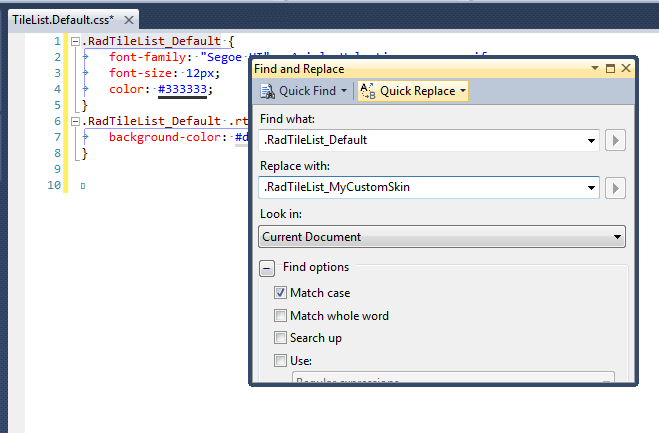

# Tutorial: Creating a Custom Skin

## RadTileList Tutorial: Creating a Custom Skin

Each of the controls included in the Telerik UI for ASP.NET AJAX suite is styled by two CSS files that are loaded in a certain order. The first one - **ControlName.css**, also called the base stylesheet contains CSS properties and values that are common for all skins, i.e. it is layout-specific, not skin-specific. These are CSS float, padding, margin, font-size, font-family, etc. In the general case, when creating a custom skin for a control this file should not be edited, unless the custom skin needs different sizes, paddings or margins.The second file represents the actual skin of the control, and its name consists of the control name plus the skin name, i.e. **TileList.Default.css**. Upon creating a custom skin for the control, one should edit that particular file, as it contains skin-specific CSS properties, and references to images, colors, borders and backgrounds.

## Creating a Custom Skin for RadTileList for ASP.NET AJAX from an Existing One

1. In your project, create a new directory named Skins

1. In the Skins folder create a new directory **MyCustomSkin**. 

1. Go to **~/[TelerikControlsInstallationFolder]/Skins/Default** and copy **TileList.Default.css** and the **Skins/Default/TileList** folder in your Skins folder. 

1. Rename **TileList.Default.css** to **TileList.MyCustomSkin.css** and the folder **Default** to **MyCustomSkin**. 

1. When you are finished you should have **Skins/MyCustomSkin/TileList.MyCustomSkin.css** and **Skins/MyCustomSkin/TileList**. The last folder contains the images for **MyCustomSkin**. 

1. In order to support multiple skins of RadTileList on a single page, the wrapping skin-specific class is coined by the name of the control, RadTileList plus underscore ("_") plus SkinName, i.e. **.RadTileList_Default**, so in order to create a custom skin out of the Default skin, we should rename all occurrences of "**Default**" in **TileList.MyCustomSkin.css** to "**MyCustomSkin**" as shown below:

	

1. Add a new server declaration of RadTileList on your page, and set Skin="MyCustomSkin" and EnableEmbeddedSkins="false":

	__ASP.NET__

		<telerik:RadTileList runat="server" EnableEmbeddedSkins="false" Skin="MyCustomSkin"></telerik:RadTileList>

1. Register TileList.MyCustomSkin.css in the `<head>...</head>` section of your webpage. In order to have the CSS applied correctly, the base stylesheet should come first in the DOM:

	__HTML__

		<link rel="stylesheet" type="text/css" href="Skins/MyCustomSkin/TileList.MyCustomSkin.css"></link>

	Make sure the path to the files is correct, otherwise the skin will not apply.

1. Reload the page, and if the steps 1-9 have been followed correctly, you will see RadTileList running a custom Default skin set as an external resource.

>tip If you use RadTileList together with RadTile you will need to [create a custom skin for RadTile]() also.

# See Also

* [Tutorial: Creating a Custom Skin for RadTile]()