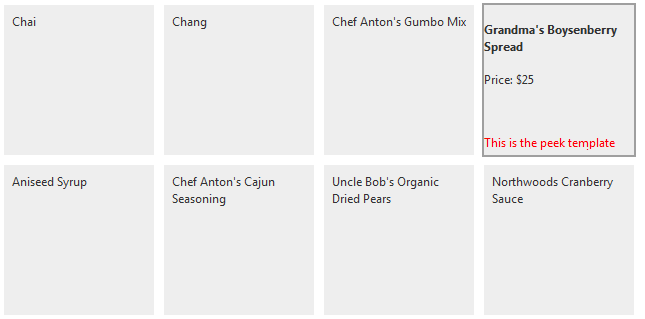

# OnClientTileDataBound


This article demonstrates how the **OnClientTileDataBound** event can be used to further configure the Tile elements via its client-side API.


The **OnClientTileDataBound** event is raised when the tile is bound to the fetched data.

The event handler receives two arguments:

1. the [RadTileList object]() that fired the event

1. an event arguments object that exposes the following methods


>caption OnClientTileDataBound event arguments object

|  **Name**  |  **Return type**  |  **Arguments**  |  **Description**  |
| ------ | ------ | ------ | ------ |
|get_dataItem()|object||Gets the data source object.|
|get_tile()|object||Gets the client-side object of the bound tile.|

**Example 1** demonstrates how to use the **OnClientTileDataBound** event to configure the [PeekTemplateSettings]() client-side. The result of the sample code is shown in **Figure 1**.

>caption Figure 1: Shows the configured Peek Template



**Example 1**: Using **OnClientTileDataBound** event to define Peek Template settings.

````ASP.NET
<telerik:RadClientDataSource runat="server" ID="RadClientDataSource1" PageSize="8" AllowPaging="true">
	<DataSource>
		<WebServiceDataSourceSettings BaseUrl="http://demos.kendoui.com/service/">
			<Select Url="products" DataType="JSONP" />
		</WebServiceDataSourceSettings>
	</DataSource>
</telerik:RadClientDataSource>

<telerik:RadTileList RenderMode="Lightweight" runat="server" ID="RadTileList1" Height="400" 
	ClientDataSourceID="RadClientDataSource1" OnClientTileDataBound="OnClientTileDataBound">
	<DataBindings>
		<CommonTileBinding TileType="RadTextTile" DataNameField="ProductID" />
		<TextTileBinding DataTextField="ProductName" />
		<ClientTilePeekTemplate>
			<h4>#=ProductName#</h4>
            <p>Price: $#=UnitPrice#</p>
			<br/>
			<br/>
			<span style="color:red;">This is the peek template</span>
		</ClientTilePeekTemplate>
	</DataBindings>
</telerik:RadTileList>


<script type="text/javascript">
	function OnClientTileDataBound(sender, args) {
		var tile = args.get_tile();

		tile.set_peekShowInterval(0);
		tile.set_peekCloseDelay(0);
		tile.set_showPeekTemplateOnMouseOver(true);
		tile.set_hidePeekTemplateOnMouseOut(true);
		tile.clearPeekShowInterval();
	}
</script>
````


# See Also

 * [Client-side Data Binding]()
