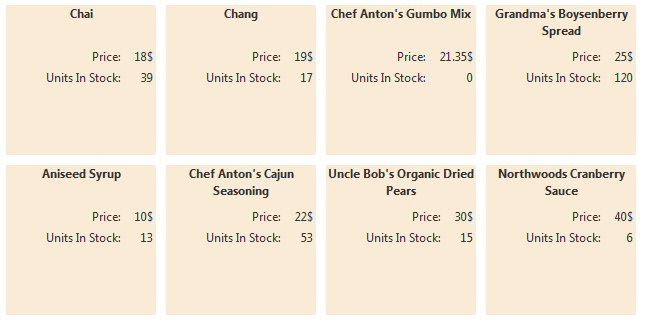
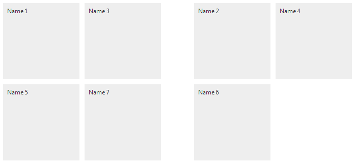
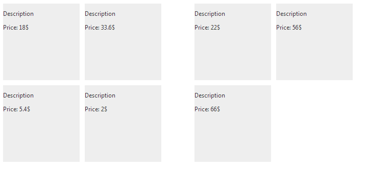

# Client-side Data Binding


This article demonstrates how the __RadTileList__ can be bound to a client-side data source.

## Getting Started with Client-side Data Binding

Data binding the __TileList__ can be done with:

* the __RadClientDataSource__ control by setting its ID to the TileList's__ClientDataSourceID__ property;

* using the __set_dataSource()__ method to attach an already requested data sourceand invoke the __dataBind()__ method to start the binding.

Designing the tiles and defining the data fields requested from the data source can be achieved with the same approach as described in the	[Data Binding Basics]() article - defining the layout of the tiles using the Data Binding properties in the __DataBindings__tag with the appropriate data field names.

The main difference is generating the __ClientTilePeekTemplate__ and the __ContentTemplateTileBinding__. You can design themusing only HTML code where the fetched data source fields should be set with this syntax - __#= datasourceField #__.

The following sections provide examples which will clarify the data binding matter of the __RadTileList__ control.

## Data Binding the TileList using the RadClientDataSource control

The __RadClientDataSource__ provides the ability to connect to a web service and fetch data to bind any appropriate Telerik control.After configuring the ClientDataSource with the needed settings, all you need is to set its ID to the __ClientDataSourceID__ propertyof the __RadTileList__ control. __Example 1__ demonstrates a sample implementation of such approach and shows how the__ContentTemplateTileBinding__ is used in client-side data binding scenario. The result of the implemented code is shown in __Figure 1__.
>caption Figure 1: TileList data binding via the RadClientDataSource control



__Example 1__: Using the __RadClientDataSource__ control for __RadTileList__ data binding

````ASPNET
		<telerik:RadClientDataSource runat="server" ID="RadClientDataSource1" PageSize="8" AllowPaging="true">
			<DataSource>
				<WebServiceDataSourceSettings BaseUrl="http://demos.kendoui.com/service/">
					<Select Url="products" DataType="JSONP" />
				</WebServiceDataSourceSettings>
			</DataSource>
		</telerik:RadClientDataSource>
		
		<telerik:RadTileList runat="server" ID="RadTileList1" Height="400" ClientDataSourceID="RadClientDataSource1">
			<DataBindings>
				<CommonTileBinding TileType="RadContentTemplateTile" DataNameField="ProductID" />
				<ContentTemplateTileBinding>
					<ClientContentTemplate>
					<div style="width:150px; height:150px; background-color:antiquewhite;">
						<h4 style="text-align:center; margin:0; min-height:40px;">#= ProductName #</h4>
						<table style="text-align:right; width:100%;">
							<tbody>
								<tr>
									<td>Price: </td>
									<td>#= UnitPrice #$</td>
								</tr>
								<tr>
									<td>Units In Stock: </td>
									<td>#= UnitsInStock #</td>
								</tr>
							</tbody>
						</table>
					</div>
					</ClientContentTemplate>
				</ContentTemplateTileBinding>
			</DataBindings>
		</telerik:RadTileList>
````


## Simple Data Binding

__Example 2__ demonstrates how the __set_dataSource()__ and the __dataBind()__methods are used to bind the __TileList__ to a simple dummy JS array. You can examine __Figure 2__ which shows	the result from the set data binding properties in the __DataBindings__ tag by generating the groups of the TileList and	define the elements of the [RadTextTile]() type.

And in __Figure 3__ - how the __ClientTilePeekTemplate__ is designed using HTML markup and how the	data field names should be declared.
>caption Figure 2: TileList bound to a simple JS array


>caption Figure 3: The resulted peek template from the markup in Example 1



__Example 2__: Simple data binding of the __RadTileList__ control.

````ASPNET
			<telerik:RadTileList runat="server" ID="RadTileList1" Height="400" OnClientLoad="OnClientLoad">
				<DataBindings>
					<CommonTileBinding TileType="RadTextTile" DataNameField="ProductID" DataGroupNameField="Group" />
					<TextTileBinding DataTextField="ProductName" />
					<ClientTilePeekTemplate>
						<div style="background-color:cyan;">
							<p>#= Description #</p>
							<p>Price: #= Price #$</p>
						</div>
					</ClientTilePeekTemplate>
				</DataBindings>
			</telerik:RadTileList>
			
			<script type="text/javascript">
				var dataSource = [
					{ ProductID: 0, ProductName: "Name 1", Description: "Description", Price: "18", Group: "Group1" },
					{ ProductID: 1, ProductName: "Name 2", Description: "Description", Price: "22", Group: "Group2" },
					{ ProductID: 2, ProductName: "Name 3", Description: "Description", Price: "33.6", Group: "Group1" },
					{ ProductID: 3, ProductName: "Name 4", Description: "Description", Price: "56", Group: "Group2" },
					{ ProductID: 4, ProductName: "Name 5", Description: "Description", Price: "5.4", Group: "Group1" },
					{ ProductID: 5, ProductName: "Name 6", Description: "Description", Price: "66", Group: "Group2" },
					{ ProductID: 6, ProductName: "Name 7", Description: "Description", Price: "2", Group: "Group1" }
				];
	
				function OnClientLoad(sender, args) {
					var tileList = sender;
	
					tileList.set_dataSource(dataSource);
					tileList.dataBind();
				}
	
			</script>
````


# See Also

 * [Overview]()
