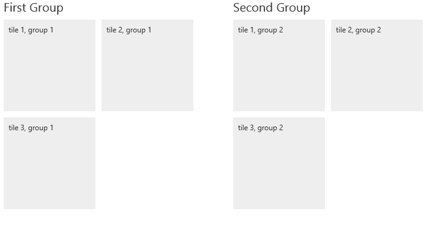

# Group Title

**RadTileList** offers **group titles** (**Figure 1**) as of **Q1 2016**. To set the title of a group, use its `Title` property (**Example 1**). You can also set it on the client side via the `set_groupTitle` method (**Example 2**).

When data binding a TileList control, you can set the group titles declaratively when you [define the groups structure](). Alternatively, you can use the [OnTileDataBound]() event to access the associated data item and set a group's title according to your business logic. You can see this in action in the [Declarative DataSource](https://demos.telerik.com/aspnet-ajax/tilelist/examples/data-binding/server-side-binding/declarative-data-source/defaultcs.aspx) Live Demo.

>caption Figure 1: Group Titles in RadTileList



>caption Example 1: Set group title via server property. This code results in Figure 1.

````
<telerik:RadTileList RenderMode="Lightweight" runat="server" ID="RadTileList1">
	<Groups>
		<telerik:TileGroup Title="First Group">
			<telerik:RadTextTile runat="server" ID="RadTextTile1" Text="tile 1, group 1"></telerik:RadTextTile>
			<telerik:RadTextTile runat="server" ID="RadTextTile2" Text="tile 2, group 1"></telerik:RadTextTile>
			<telerik:RadTextTile runat="server" ID="RadTextTile3" Text="tile 3, group 1"></telerik:RadTextTile>
		</telerik:TileGroup>
		<telerik:TileGroup Title="Second Group">
			<telerik:RadTextTile runat="server" ID="RadTextTile4" Text="tile 1, group 2"></telerik:RadTextTile>
			<telerik:RadTextTile runat="server" ID="RadTextTile5" Text="tile 2, group 2"></telerik:RadTextTile>
			<telerik:RadTextTile runat="server" ID="RadTextTile6" Text="tile 3, group 2"></telerik:RadTextTile>
		</telerik:TileGroup>
	</Groups>
</telerik:RadTileList>
```` 

>caption Example 2: Set group title on the client side.

````ASP.NET
<asp:Button ID="Button1" Text="set group titles" OnClientClick="setGroupTitles(); return false;" runat="server" />
<script type="text/javascript">
	function setGroupTitles() {
		var tileList = $find("<%=RadTileList1.ClientID%>");
		var groups = tileList.get_groups();
		groups.forEach(function (group, index) {
			var tileCount = group.get_tiles().get_count();
			var title = "Tiles number: " + tileCount;
			tileList.set_groupTitle(group, title);
		});
	}
</script>
<telerik:RadTileList RenderMode="Lightweight" runat="server" ID="RadTileList1">
	<Groups>
		<telerik:TileGroup>
			<telerik:RadTextTile runat="server" ID="RadTextTile1" Text="tile 1, group 1"></telerik:RadTextTile>
			<telerik:RadTextTile runat="server" ID="RadTextTile2" Text="tile 2, group 1"></telerik:RadTextTile>
			<telerik:RadTextTile runat="server" ID="RadTextTile3" Text="tile 3, group 1"></telerik:RadTextTile>
		</telerik:TileGroup>
		<telerik:TileGroup>
			<telerik:RadTextTile runat="server" ID="RadTextTile4" Text="tile 1, group 2"></telerik:RadTextTile>
			<telerik:RadTextTile runat="server" ID="RadTextTile5" Text="tile 2, group 2"></telerik:RadTextTile>
			<telerik:RadTextTile runat="server" ID="RadTextTile6" Text="tile 3, group 2"></telerik:RadTextTile>
		</telerik:TileGroup>
	</Groups>
</telerik:RadTileList>
````

>caption Example 3: Clearing group titles on the client.

````
<asp:Button ID="Button1" Text="clear group titles" OnClientClick="clearGroupTitles(); return false;" runat="server" />
<script type="text/javascript">
	function clearGroupTitles() {
		var tileList = $find("<%=RadTileList1.ClientID%>");
		tileList.clearGroupTitles();
	}
</script>
<telerik:RadTileList RenderMode="Lightweight" runat="server" ID="RadTileList1">
	<Groups>
		<telerik:TileGroup Title="First Group">
			<telerik:RadTextTile runat="server" ID="RadTextTile1" Text="tile 1, group 1"></telerik:RadTextTile>
			<telerik:RadTextTile runat="server" ID="RadTextTile2" Text="tile 2, group 1"></telerik:RadTextTile>
			<telerik:RadTextTile runat="server" ID="RadTextTile3" Text="tile 3, group 1"></telerik:RadTextTile>
		</telerik:TileGroup>
		<telerik:TileGroup Title="Second Group">
			<telerik:RadTextTile runat="server" ID="RadTextTile4" Text="tile 1, group 2"></telerik:RadTextTile>
			<telerik:RadTextTile runat="server" ID="RadTextTile5" Text="tile 2, group 2"></telerik:RadTextTile>
			<telerik:RadTextTile runat="server" ID="RadTextTile6" Text="tile 3, group 2"></telerik:RadTextTile>
		</telerik:TileGroup>
	</Groups>
</telerik:RadTileList>
```` 


# See Also

 * [Defining Structure]()

 * [Live Demo: Declarative DataSource](https://demos.telerik.com/aspnet-ajax/tilelist/examples/data-binding/server-side-binding/declarative-data-source/defaultcs.aspx)
