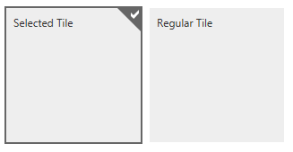

# Selecting

## 

To select a given tile in __RadTileList__ the __right mouse button__ must be used, like it is in Windows 8.The other option is to __hold down the tile and drag it a little downward or upward__. This can be done either with the mouse or with a touch screen.This is also the default behavior in Windows 8.

Once a tile is selected a small indicator will appear in its top right corner - a small triangle with a tick sign.

There are three __selection modes__ that the control supports:

* None - selection is disabled

* Single - only one tile can be selected at any given time

* Multiple - many tiles can be selected simultaneously

The selection mode can be toggled on the __server__ through the server-side __SelectionMode__ propertythat takes a member of the __Telerik.Web.UI.TileList.TileListSelectionMode__ enum - None, Single or Multiple.The other option is to use __JavaScript__ and the set_selectionMode() method that also takes a member of an enum with the same name,e.g. *set_selectionMode(Telerik.Web.UI.TileList.TileListSelectionMode.None)*.

If selection mode is changed from multiple to single and there are multiple tiles selected only one will remain selected -	the tile that is last in the list.

See the [Selecting online demo](http://demos.telerik.com/aspnet-ajax/tilelist/examples/selecting/defaultcs.aspx)to see the feature in action.

The control also exposes the __AutoPostBack__ property which indicates whetheran automatic postback will be triggered once a tile is selected. It defaults to false.

The developer can react to the user's actions through the __events__ the control exposes:

* __OnSelectionChanged__ - raised on the server with each selection if AutoPostBack is set to true

* __OnClientTileSelecting__ - raised on the client when a tile is about to be selected.Can be cancelled to prevent selection according to a desired logic

* __OnClientTileSelected__ - raised after a tile is selected

A given __tile__ selection status can be toggled through its __Selected__ property. It can be setin the markup, the code-behind or though JavaScript through the set_selected(isSelected) method each tile object exposes.

>tip You can use the[RadPersistenceFramework](8fc21445-ae36-4444-9e27-954d3cb99750)to store the order and selected state of tiles for your end users, so they can customize the appearance of their TileList.
>

# See Also

 * [Selecting online demo](http://demos.telerik.com/aspnet-ajax/tilelist/examples/selecting/defaultcs.aspx)
