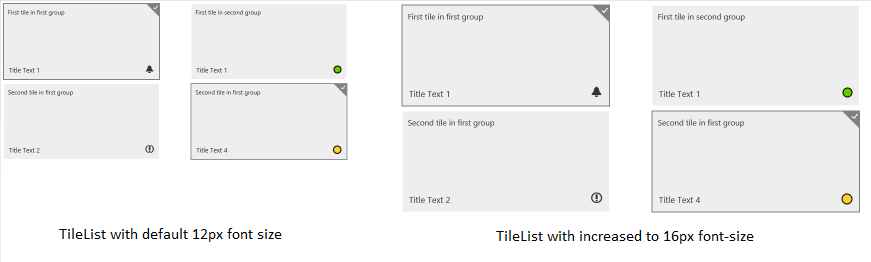

# Elastic Capabilities


This article explains the **elastic design capabilities RadTileList offers**.	The [Lightweight RenderMode]() of RadTileList supports **elastic design as of Q3 2015** (**Figure 1**).

Generally, responsive design means that the page and its content are able to adapt to different screen resolutions without deteriorating	the user experience. This often includes changing the font size and having dimensions set in percent.


>caption Figure 1: Comparison between the appearance of a RadTileList with regular font size and with increased font size (50% scale).




**RadTileList** does not create elastic design by itself, but can fit in a page that follows this pattern. This means that its **Lightweight RenderMode** supports **changing the font size** without breaking the control's appearance - if the new size is larger than the original, the elements in the control will simply increase their size as well to accommodate the text. This fluid layout is achieved by using `em` units for setting dimensions and paddings in the control, instead of `px`because `em` units are tied to the font size. This allows dimensions and sizes to scale with the font size.


>note **RadTileList** takes the font-size of the page automatically. If the developer does not set it explicitly (**Example 1**), this is up to the client's browser and a common default value is 16px.


>caption **Example 1**: Setting default font for the page with the default value for the Telerik controls.

```CSS
body {
	font-size: 12px; /* 12px is the default value for Telerik controls */
	font-family: "Segoe UI", Arial, Sans-serif;
}
````


>caption **Example 2**: Changing the font-size of a TileList via page-level CSS rules. 

````CSS
body {
	font-size: 16px;
	font-family: "Segoe UI", Arial, Sans-serif;
}
````
````ASP.NET
<telerik:RadTileList RenderMode="Lightweight" runat="server" ID="RadTileList1" SelectionMode="Multiple" TileRows="2">
	<Groups>
		<telerik:TileGroup>
			<telerik:RadTextTile runat="server" ID="RadTextTile1" Selected="true" Text="First tile in first group" Shape="Wide">
				<Badge PredefinedType="Alert" />
				<Title Text="Title Text 1"></Title>
			</telerik:RadTextTile>
			<telerik:RadTextTile runat="server" ID="RadTextTile2" Text="Second tile in first group" Shape="Wide">
				<Badge PredefinedType="Attention" />
				<Title Text="Title Text 2"></Title>
			</telerik:RadTextTile>
		</telerik:TileGroup>
		<telerik:TileGroup>
			<telerik:RadTextTile runat="server" ID="RadTextTile3" Text="First tile in second group" Shape="Wide">
				<Badge PredefinedType="Available" />
				<Title Text="Title Text 1"></Title>
			</telerik:RadTextTile>
			<telerik:RadTextTile runat="server" ID="RadTextTile4" Selected="true" Text="Second tile in first group" Shape="Wide">
				<Badge PredefinedType="Away" />
				<Title Text="Title Text 4"></Title>
			</telerik:RadTextTile>
		</telerik:TileGroup>
	</Groups>
</telerik:RadTileList>
````

>tip You can apply the CSS rule to the TileList only, or to its container if you do not want to change the entire page.

>caption **Example 3**: Changing the font-size of a TileList via the control's Font-Size property. 

````ASP.NET
<telerik:RadTileList RenderMode="Lightweight" Font-Size="16px" runat="server" ID="RadTileList1" SelectionMode="Multiple" TileRows="2">
	<Groups>
		<telerik:TileGroup>
			<telerik:RadTextTile runat="server" ID="RadTextTile1" Selected="true" Text="First tile in first group" Shape="Wide">
				<Badge PredefinedType="Alert" />
				<Title Text="Title Text 1"></Title>
			</telerik:RadTextTile>
			<telerik:RadTextTile runat="server" ID="RadTextTile2" Text="Second tile in first group" Shape="Wide">
				<Badge PredefinedType="Attention" />
				<Title Text="Title Text 2"></Title>
			</telerik:RadTextTile>
		</telerik:TileGroup>
		<telerik:TileGroup>
			<telerik:RadTextTile runat="server" ID="RadTextTile3" Text="First tile in second group" Shape="Wide">
				<Badge PredefinedType="Available" />
				<Title Text="Title Text 1"></Title>
			</telerik:RadTextTile>
			<telerik:RadTextTile runat="server" ID="RadTextTile4" Selected="true" Text="Second tile in first group" Shape="Wide">
				<Badge PredefinedType="Away" />
				<Title Text="Title Text 4"></Title>
			</telerik:RadTextTile>
		</telerik:TileGroup>
	</Groups>
</telerik:RadTileList>
````


# See Also


 * [Render Modes]()

 * [Responsive Capabilities]()
