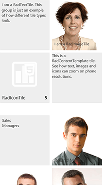

# Responsive, Adaptive and Elastic Capabilities


__RadTileList__ (__Figure 1__) can provide __responsive layout__ that reacts to the size of the available viewport.	Depending on the viewport size, __RadTileList__ will __automatically__ change its appearance to better fit the screen.	This feature is enabled by setting the __RenderMode__ property to __Mobile__.	This help article will show three layouts supported by __RadTileList__ (standard, tablet-oriented, phone-oriented)and then will show the code example used to generate the figures below.

Depending on the viewport width, the layout can be:

* __standard__—columns and groups of tiles with rows that flow to the right (__Figure 1__). The number of rows depends on the __Height__	and __TileRows__ properties of the control. This "*standard*" layout is the default and this is how	__RadTileList__ usually renders.	This mode is in effect	__for viewports wider than 768px__.
>caption Figure 1: The RadTileList's default (desktop) layout. The image is in 50% scale.


* __tablet-oriented__—tile groups appear vertically under each other (__Figure 2__) and there are no separate tile columns; all tiles flow next to each other. This is in effect	__for viewports between 480px and 768px wide__.
>caption Figure 2: The RadTileList's tablet-oriented layout. The image is in 50% scale.


* __phone-oriented__—tile groups appear stacked under each other (__Figure 3__). There are two tiles adjacent to each other that zoom according to the available screen width. This is in effect	__for viewports less than 480px wide__.
>caption Figure 3: The RadTileList's phone-oriented layout. The image is in 50% scale.



You can find the code that produces this __RadTileList__ at the end of the article—__Example 4__.

Telerik released the responsive layout feature for __RadTileList__ in the __Q1 2014__ release.

To read more about the CSS rules that achieve the different layouts, examine the	[CSS for RadTileList and RadTile Responsive Layout]() help article.

>important  __RadTileList__ is designed to be a high-level element on the page (i.e., not nested deeply in the control hierarchy),because it reacts to the viewport size. Thus, placing it in an element with dimensions smaller than the viewportmay result in incorrect appearance or missing scrollbars.
>Changing the tiles order in the standard layout (i.e., the number of columns) requires a call to the __.repaint()__ [client-side method]()of the __RadTileList__ .This is an expensive operation and it should not be invoked arbitrarily. Therefore, __heights in percent are not supported__ .
>To see how to integrate the __RadTileList__ in a nested or initially hidden element or how to support dynamic height,examine the[RadTileList responsive layout and dynamic height]()help article.
>


## Preparing the Responsive Layout

To enable the responsive layout, you need to:

* Set the __[RenderMode]()__ property of the control to __Mobile__. If `Auto` is set,responsive layout will be available only on mobile devices.__Example 1: A sample setting for the RenderMode of a RadTileList control that enables responsive layout:__

````HTML
	 <telerik:RadTileList runat="server" ID="RadTileList1" RenderMode="Mobile"></telerik:RadTileList>
````


* Add the following meta tag to the head section of the page.__Example 2: The meta tag that is needed for the responsive layout of a RadTileList to work:__

````HTML
	<head id="Head1" runat="server">
		<meta name="viewport" content="width=device-width, initial-scale=1" />
	</head>
	
````


By default, __RadTileList__ will calculate the __TileRows__ value for a best fit in the available height.Thus, *you do not need to set the __TileRows__ property*. If you set it explicitly, its value will be taken into account and no automatic calculations will be performed. This may leave	you with too many rows or empty space below the tiles if the value is not properly calculated according to the __Height__ property.

Removing the default padding or margins the browser adds can also improve the appearance, so we also advise that you include the CSS from __Example 3__ on your page.

__Example 3: CSS rules to minimize unwanted margins and padding from the browser.__

````HTML
				html, body, form
				{
					margin: 0;
					padding: 0;
				}
````


## Sample Code

__Example 4__ shows the declaration that creates __Figures 1-3__. It is important to note that the __RenderMode=Mobile__ property and	that __Height is set__to provide dimensions for the standard (desktop) layout. Most of the other code is related to generating and styling the tiles themselves.

__Example 4: The actual declaration that will produce Figures 1-3.__

````ASPNET
	<head id="Head1" runat="server">
		<title></title>
		<meta name="viewport" content="width=device-width, initial-scale=1" />
		<style type="text/css">
			html, body, form
			{
				margin: 0;
				padding: 0;
			}
		</style>
	</head>
	<body>
		<form id="form1" runat="server">
		<telerik:RadScriptManager ID="RadScriptManager1" runat="server">
		</telerik:RadScriptManager>
		<telerik:RadTileList RenderMode="Mobile" Height="500px" ID="RadTileList1" runat="server">
			<Groups>
				<telerik:TileGroup Name="Tile types">
					<telerik:RadTextTile Text="I am a RadTextTile. This group is just an example of how different tile types look.">
					</telerik:RadTextTile>
					<telerik:RadImageAndTextTile ImageUrl="Img/Northwind/Customers/CONSH.jpg" Text="I am a RadImageTile">
					</telerik:RadImageAndTextTile>
					<telerik:RadIconTile ImageUrl="TileList/Img/Icons/icon_chart.png">
						<Badge Value="5" />
						<Title Text="RadIconTile"></Title>
					</telerik:RadIconTile>
					<telerik:RadContentTemplateTile>
						<ContentTemplate>
							This is a RadContentTemplate tile. <br />
							See how text, images and icons can zoom on phone resolutions.
						</ContentTemplate>
					</telerik:RadContentTemplateTile>
				</telerik:TileGroup>
				<telerik:TileGroup Name="Sales Managers">
					<telerik:RadContentTemplateTile ID="SalesManagersGroupTitle" runat="server" Shape="Square">
						<ContentTemplate>
							<div style="padding: 10px;">
								Sales<br />
								Managers
							</div>
						</ContentTemplate>
					</telerik:RadContentTemplateTile>
					<telerik:RadImageTile ImageUrl="Img/Northwind/Customers/ERNSH.jpg">
						<Title Text="Roland Mendel" />
					</telerik:RadImageTile>
					<telerik:RadImageTile ImageUrl="Img/Northwind/Customers/FURIB.jpg">
						<Title Text="Lino Rodriguez" />
					</telerik:RadImageTile>
					<telerik:RadImageTile ImageUrl="Img/Northwind/Customers/GODOS.jpg">
						<Title Text="Jose Pedro Freyre" />
					</telerik:RadImageTile>
					<telerik:RadImageTile ImageUrl="Img/Northwind/Customers/LAMAI.jpg">
						<Title Text="Annette Roulet" />
					</telerik:RadImageTile>
					<telerik:RadImageTile ImageUrl="Img/Northwind/Customers/LONEP.jpg">
						<Title Text="Fran Wilson" />
					</telerik:RadImageTile>
					<telerik:RadImageTile ImageUrl="Img/Northwind/Customers/PICCO.jpg">
						<Title Text="Georg Pipps" />
					</telerik:RadImageTile>
					<telerik:RadImageTile ImageUrl="Img/Northwind/Customers/RICSU.jpg">
						<Title Text="Michael Holz" />
					</telerik:RadImageTile>
					<telerik:RadImageTile ImageUrl="Img/Northwind/Customers/SEVES.jpg">
						<Title Text="Hari Kumar" />
					</telerik:RadImageTile>
					<telerik:RadImageTile ImageUrl="Img/Northwind/Customers/SPLIR.jpg">
						<Title Text="Art Braunschweiger" />
					</telerik:RadImageTile>
					<telerik:RadImageTile ImageUrl="Img/Northwind/Customers/VAFFE.jpg">
						<Title Text="Palle Ibsen" />
					</telerik:RadImageTile>
					<telerik:RadImageTile ImageUrl="Img/Northwind/Customers/WELLI.jpg">
						<Title Text="Paula Parente" />
					</telerik:RadImageTile>
				</telerik:TileGroup>
			</Groups>
		</telerik:RadTileList>
		</form>
	</body>
````


You can find the actual images by downloading the Telerik UI for ASP.NET AJAX Live Demos from your account. At the root of the site, the *Img*folder contains a lot of images, and some of them are used for the examples in this help article. You can find the chart icon for the	__RadIconTile__ example in the *TileList\Img\Icons* folder.You may also find useful the[RadTileList Data Binding demo](http://demos.telerik.com/aspnet-ajax/tilelist/examples/databinding/defaultcs.aspx) that you can use as base to easily generate a lot of tiles from a data source.

# See Also

 * [CSS for Responsive Layout]()

 * [RadTileList Responsive Layout and Dynamic Height]()

 * [RadTileList Responsive Layout: Live Demo](http://demos.telerik.com/responsive-web-design-aspnet/samples/responsive/tilelist.aspx)

 * [Render Modes]()

 * [Demo: RadTileList Data Binding](http://demos.telerik.com/aspnet-ajax/tilelist/examples/databinding/defaultcs.aspx)

 * [Data Binding Basics]()
