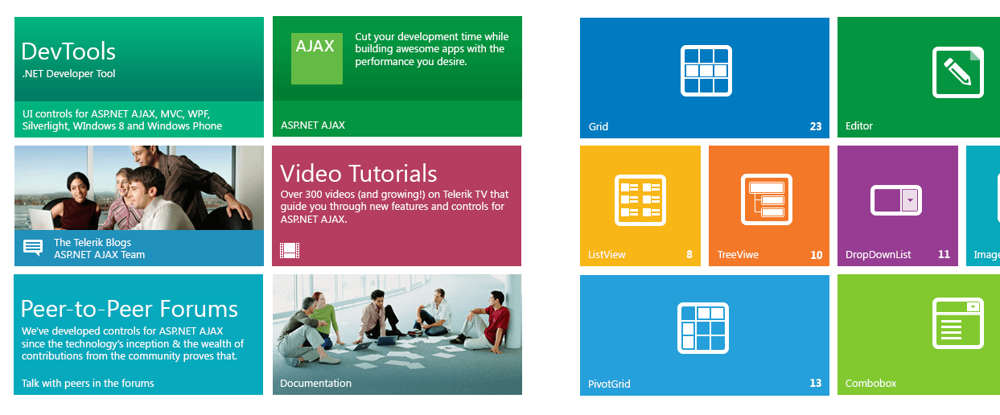

# TileList Overview

**RadTileList** brings the popular Windows 8 Start Menu interface to the web and lets you build a user friendly navigationfor your site. Take advantage of the predefined tile types and shapes to build an engaging menu for your users.

Since **Q3 2013** the [Tiles]() can be used as standalone controls with their own events, methods and properties.

The control offers a rich set of features:

* **Various Tile types**

	* [Text tile]()—for simple text
	
	* [Image tile]()—for a simple image
	
	* [Image And Text tile]()—An image and text below
	
	* [Icon tile]()—a smaller image is placed in the middle of the tile
	
	* [ContentTemplate tile]()—lets you create your own layout inside the tile
	
	* [Live tile]()—performs periodic requests for data that it will feed into your template

* **Two tile shapes**

	* Wide—310x150px
	
	* Square—150x150px

* **[All essential tile elements]()**

	* Title—an image or text in the tile's bottom corner that indicates the purpose of the tile
	
	* Badge—a smaller image or a numerical value in the other bottom corner. A predefined set of images that match our skins is also available

* **[Data binding]()**—the control can generate Tiles according to information from a datasource.

* **[Client-side Data binding]()**—the control can generate Tiles according to informationfrom a simple client-side datasource or using the **RadClientDataSource** control.

* **[Responsive layout]()**—the layout of the tiles and groups can change automatically according to the browser's viewport size to provide the best fit.

* **[Peek templates]()**—customizable content that will replace the original tile contentaccording to a set of rules—automatic timers, mouseover and mouseout; as well as a rich set of animations.

* **[Drag and drop]()**—tiles can be dragged to a different location so the end user can customize the appearance of the TileList.

* **[Rich API and events]()**—both on the server and on the client

* **[Easy navigation]()**—just set an URL and target to take the user to the desired page

* **[Native scrolling]()**—you can let the browser scroll the control, disable scrolling, or let evendesktop users benefit from click-and-drag scrolling like in a touch device.

* **[Customizable selection]()**—the users can select tiles like in Windows8 so you can get this information.You can let them select as many as they like, only one, or disable the feature.

* **[Right-to-left support]()**

* **[Semantic rendering]()**—as lightweight as possible, no tables are used and the title elements are `<h6>` elements.

Here is an example of what you can achieve with the control:

# See Also

 * [Tiles Overview]()
