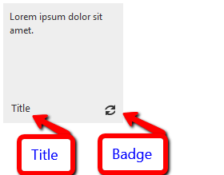

# Badge and Title Elements


## Overview

The **Badge** and the **Title** of each tile are the two constant indicators that are shown on the tile, even when the **Peek Template** is shown. They can be used to convey information to the user in a visual manner (e.g. through images) or through text (the title) and a number (the badge).

The title is in the bottom left corner of the tile and the badge is in the bottom right corner. They have a 10px offset from the border of the tile.



Here is the sample declaration that results in the above screenshot:

**RadTileList** example:

````ASP.NET
<telerik:RadTileList RenderMode="Lightweight" runat="server" id="RadTileList1">
<Groups>
	<telerik:TileGroup>
		<telerik:RadTextTile Text="Lorem ipsum dolor sit amet.">
			<Title Text="Title"></Title>
			<Badge PredefinedType="Activity" />
		</telerik:RadTextTile>
	</telerik:TileGroup>
</Groups>
</telerik:RadTileList>
````


Standalone **Tile** example:

````ASP.NET
<telerik:RadTextTile ID="Tile1" runat="server" Text="Lorem ipsum dolor sit amet.">
	<Title Text="Title"></Title>
	<Badge PredefinedType="Activity" />
</telerik:RadTextTile>
````


## Title

It is placed in the bottom left corner of the tile and the inner **`<Title>`** tagin each tile is used to control it. There are two properties it exposes:

* Text - this is the string that is displayed in the title.

* ImageUrl - the URL to an image that will be used as title for the badge. It takes precedence over the text.

When text is used it is rendered inside an `<h6>` element that takes 70% of the tile's width when in text mode. The 10px offsets are kept for both text and image title. There are no minimum or maximum dimensions for the image title so the developer can design the tile freely.

## Badge

The **`<Badge>`** inner tag inside each tile controls the behavior of the badge.It exposes the following ways to set the content, listed in order of precedence (the last one hasthe highest priority).

* ImageUrl - the URL to the image that will be shown in the title

* PredefinedType - uses one of the predefined 16 by 16 pixel images that are designed to match the skins of the control.The available options in the `Telerik.Web.UI.TileBadgeType` enum are:

	* None
	
	* Activity
	
	* Alert
	
	* Attention
	
	* Available
	
	* Away
	
	* Busy
	
	* Error
	
	* NewMessage
	
	* Paused
	
	* Playing
	
	* Unavailable

* Value - an integer value that is shown instead of an image
