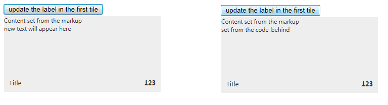

# ContentTemplate Tile


## 

The __RadContentTemplateTile__ is a tile that allows the developer to set any content in the primary content of the tileas well as in the [Peek template]().This is done by using the __ContentTemplate__ inner tag in the markup and controls can be added programmaticallyin the code-behind to the tile's __ContentContainer__.

>note The examples below show specific functionality for the given tile type, for more infomration on the general options	for navigation and selecting please examine the additional resources at the end of the article.
>


The following example shows a simple declaration of a __RadContentTemplateTile__ and how to access both the tile itself,and the controls inside:

__RadTileList__ example:

>tabbedCode

````ASPNET
		<asp:Button ID="Button1" Text="update the label in the first tile" OnClick="Button1_Click" runat="server" />
		<telerik:RadTileList runat="server" ID="RadTileList1">
			<Groups>
				<telerik:TileGroup>
					<telerik:RadContentTemplateTile Name="firstContentTemplateTile" Shape="Wide">
						<Title Text="Title"></Title>
						<Badge Value="123" />
						<ContentTemplate>
							Content set from the markup
							<br />
							<asp:Label ID="Label1" Text="new text will appear here" runat="server" />
						</ContentTemplate>
					</telerik:RadContentTemplateTile>
				</telerik:TileGroup>
			</Groups>
		</telerik:RadTileList>
````
````C#
		protected void Button1_Click(object sender, EventArgs e)
		{
			RadContentTemplateTile firstTile = RadTileList1.GetTileByName("firstContentTemplateTile") as RadContentTemplateTile;
			(firstTile.ContentContainer.FindControl("Label1") as Label).Text = "set from the code-behind";
		}
````
````VB.NET
	    Protected Sub Button1_Click(sender As Object, e As EventArgs) Handles Button1.Click
	        Dim firstTile As RadContentTemplateTile = TryCast(RadTileList1.GetTileByName("firstContentTemplateTile"), RadContentTemplateTile)
	        TryCast(firstTile.ContentContainer.FindControl("Label1"), Label).Text = "set from the code-behind"
	    End Sub
	#End Region
	
	 #Region tile-types-contentTemplateTile-accessingControls-vb-1
	    Protected Sub Button1_Click(sender As Object, e As EventArgs)
	        TryCast(Tile1.ContentContainer.FindControl("Label1"), Label).Text = "set from the code-behind"
	    End Sub
	#End Region
	
		#Region tile-types-liveTile-page-method-example-vb-1
		<WebMethod()> _
		Public Shared Function MyPageMethod() As String
			Return DateTime.Now.ToString()
		End Function
	#End Region
	
	End Class


>end

Standalone __Tile__ example:

>tabbedCode

````ASPNET
	    <asp:Button ID="Button1" Text="update the label in the first tile" OnClick="Button1_Click" runat="server" />
	    <telerik:RadContentTemplateTile ID="Tile1" runat="server" Name="firstContentTemplateTile" Shape="Wide">
	        <Title Text="Title"></Title>
	        <Badge Value="123" />
	        <ContentTemplate>
	            Content set from the markup
	            <br />
	            <asp:Label ID="Label1" Text="new text will appear here" runat="server" />
	        </ContentTemplate>
	    </telerik:RadContentTemplateTile>
````
````C#
	    protected void Button1_Click(object sender, EventArgs e)
	    {
	        (Tile1.ContentContainer.FindControl("Label1") as Label).Text = "set from the code-behind";
	    }
````
````VB.NET
	    Protected Sub Button1_Click(sender As Object, e As EventArgs)
	        TryCast(Tile1.ContentContainer.FindControl("Label1"), Label).Text = "set from the code-behind"
	    End Sub
	#End Region
	
		#Region tile-types-liveTile-page-method-example-vb-1
		<WebMethod()> _
		Public Shared Function MyPageMethod() As String
			Return DateTime.Now.ToString()
		End Function
	#End Region
	
	End Class


>end

And this results in the following before and after the button is clicked:

# See Also

 * [Tiles configuration overview]()

 * [Peek Template]()

 * [Badge and Title Elements]()

 * [Navigation]()

 * [Selecting]()
