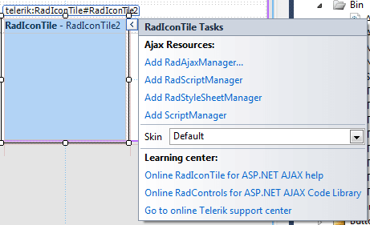

# Design-time

All **RadTile** types offer a **Smart tag** that lets you perform several basic actions:

>caption RadTile Smart Tag

* Add the main manager controls from the suite:

	* The **Add RadAjaxManager...** link adds a RadAjaxManager component to your Web page,so you can configure partial postbacks through a comfortable control.
	
	* The **Replace ScriptManager with RadScriptManager** link replaces the default ScriptManager component that is usedfor AJAX-enabled Web sites with RadScriptManager. If there isn't a ScriptManager on the page this link will allow you to add one.
	
	* The **AddRadStyleSheetManager** link adds a RadStyleSheetManager to your Web page.

* Choose the skin - The **Skin** dropdown lists all available skins for the control so you can select one that matches the look and feel of the rest of the page.The skins are displayed via small images to give you a better idea of the color scheme they use.

* Explore learning resources - the last section of the Smart Tag provides several links navigate you directly to the given tile type's online documentation and code library.

All RadTiles expose a similar smart tag with the same options, regardless of their type.
