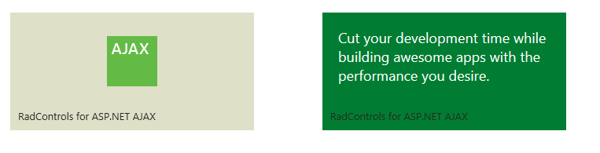

# Icon Tile


## 

A __RadIconTile__ has an image centered in its content area that is called an icon. Its URLis set through the __ImageUrl__ of the tile:

>note The examples below show specific functionality for the given tile type, for more infomration on the general options	for navigation and selecting please examine the additional resources at the end of the article.
>


__RadTileList__ example:

````ASPNET
			<telerik:RadTileList runat="server" ID="RadTileList1" Skin="Hay">
			<Groups>
				<telerik:TileGroup>
					<telerik:RadIconTile ImageUrl="icon_ajax.png" Shape="Wide">
						<Title Text="Telerik UI for ASP.NET AJAX"></Title>
						<PeekTemplate>
							<div style="padding: 20px; width: 290px; height: 110px; background-color: #007D33; color: White; font-size: 18px;">
								Cut your development time while building awesome apps with the performance you desire.
							</div>
						</PeekTemplate>
					</telerik:RadIconTile>
				</telerik:TileGroup>
			</Groups>
		</telerik:RadTileList>
````


Standalone __Tile__ example:

````ASPNET
		<telerik:RadIconTile ID="Tile1" runat="server" ImageUrl="icon_ajax.png" Shape="Wide">
			<Title Text="Telerik UI for ASP.NET AJAX"></Title>
			<PeekTemplate>
				<div style="padding: 20px; width: 290px; height: 110px; background-color: #007D33; color: White; font-size: 18px;">
					Cut your development time while building awesome apps with the performance you desire.
				</div>
			</PeekTemplate>
		</telerik:RadIconTile>
````


This is how this tile looks before and after the peek template is shown. The green rectangle in the middle of the left picture isthe *icon_ajax.png* image.

# See Also

 * [Tiles configuration overview]()

 * [Peek Template]()

 * [Badge and Title Elements]()

 * [Navigation]()

 * [Selecting]()
