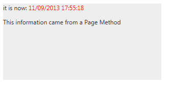

# Live Tile Overview


__RadLiveTile__ is designed to load content on demand from a Webservice on a predefined interval.It [supports various webservice types]() like WCF services,Page Methods and OData services.

The __RadLiveTile__ control was added to the Telerik UI for ASP.NET AJAX suite in __Q3 2013__.

When the __UpdateInterval__ times out a __request to the service is made__ and when the data is receivedthe __ClientTemplate__ is __populated and shown__ with an animation. If a PeekTemplate is shown at this pointit is hidden regardless of its own timers because the ClientTemplate has higher priority.

The __ClientTemplate__ property can be used to set the template that will be resolved and popupated with theinformation from the datasource. The __UpdateInterval__ property determines the intervals between requests are sent.

>tip The __ClientTemplate__ can also be used as an inner tag in the tile. This allows for more intuitive markup input, even though you cannot have intellisense because Visual Studio does not offer intellisense for string properties.
>


The inner __WebServiceSettings__ tag offers several properties that configure how the requests are made:

* __Method:__ the name of the Webservice method that will be called

* __Path:__ the URL of the Webservice that will be called. This is the path to the asmx or svc file that defines the service code or thepage whose Page Method will be called.

* __UseHttpGet:__ defines whether a GET request should be made instead of the default POST

The __ODataDataSourceID__ property of the __RadLiveTile__ can be used to set the ID of a[RadODataDataSource control](9a9b4db2-aeb8-44c2-b1d2-781280d18fdc) that will be used to contact the OData service.You can use the [OnClientDataLoading]() event to pass additional information ormodify the request.

The __Value__ property of the Tile is used to __transfer information to the web service__ that provides theactual data. It can be used to identify the tile that makes the request in order to provide specific data. For more information and examplessee the [Pass Data to the Web Service help article](). Each load-on-demand type is shown with a simple examplethat also shows how to consume the Value property.

>note The examples below show specific functionality for the given tile type, for more infomration on the general options for navigation and selecting please examine the additional resources at the end of the article.
>


## Example - RadLiveTile with Page Methods

This simple example below shows a basic configuration of the __RadLiveTile__ so that it fetches data from a __Page Method__. The end result would be similar to the image:


````ASPNET
		<asp:ScriptManager ID="ScriptManager1" runat="server" EnablePageMethods="true">
		</asp:ScriptManager>
		<telerik:RadLiveTile runat="server" ID="rlt1" UpdateInterval="2000" Shape="Wide">
			<WebServiceSettings Method="MyPageMethod" Path="Default.aspx" />
			<ClientTemplate>
				it is now: <span style="color: red;">#= data #</span>
				<p>
					This information came from a Page Method
				</p> 
			</ClientTemplate>
		</telerik:RadLiveTile>
````
````C#
		[WebMethod]
		public static string MyPageMethod()
		{
			return DateTime.Now.ToString();
		}
````
````VB.NET
		<WebMethod()> _
		Public Shared Function MyPageMethod() As String
			Return DateTime.Now.ToString()
		End Function
	#End Region
	
	End Class
````


The points of interest in this example are the following:

* The __EnablePageMethods__ property of the ScriptManager is set to __true__

* The __Path__ property of the __RadLiveTile.WebServiceSettings__ is set to the __current page__.

* arguments are not passed to the method, nor the returned object is complex. More information on passing arguments and working with the returned data in the template is available in the [Loading Data help article]().

# See Also

 * [Tiles configuration overview]()

 * [Peek Template]()

 * [Badge and Title Elements]()

 * [Navigation]()

 * [Selecting]()

 * [Loading data in RadLiveTile]()[RadODataDataSource](9a9b4db2-aeb8-44c2-b1d2-781280d18fdc)
