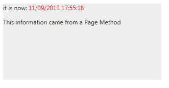

# Live Tile Overview


**RadLiveTile** is designed to load content on demand from a Webservice on a predefined interval. It [supports various webservice types]() like WCF services, Page Methods and OData services.

The **RadLiveTile** control was added to the Telerik® UI for ASP.NET AJAX suite in **Q3 2013**.

When the **UpdateInterval** times out a **request to the service is made** and when the data is received the **ClientTemplate** is **populated and shown** with an animation. If a PeekTemplate is shown at this point it is hidden regardless of its own timers because the ClientTemplate has higher priority.

The **ClientTemplate** property can be used to set the template that will be resolved and populated with the information from the datasource. The **UpdateInterval** property determines the intervals between requests are sent.

>tip The **ClientTemplate** can also be used as an inner tag in the tile. This allows for more intuitive markup input, even though you cannot have intellisense because Visual Studio does not offer intellisense for string properties.


The inner **WebServiceSettings** tag offers several properties that configure how the requests are made:

* **Method:** the name of the Webservice method that will be called

* **Path:** the URL of the Webservice that will be called. This is the path to the asmx or svc file that defines the service code or the page whose Page Method will be called.

* **UseHttpGet:** defines whether a GET request should be made instead of the default POST

The **ODataDataSourceID** property of the **RadLiveTile** can be used to set the ID of a [RadODataDataSource control]() that will be used to contact the OData service. You can use the  [OnClientDataLoading]()  event to pass additional information or modify the request.

The **Value** property of the Tile is used to **transfer information to the web service** that provides the actual data. It can be used to identify the tile that makes the request in order to provide specific data. For more information and examples see the [Pass Data to the Web Service help article](). Each load-on-demand type is shown with a simple example that also shows how to consume the Value property.

>note The examples below show specific functionality for the given tile type, for more information on the general options for navigation and selecting please examine the additional resources at the end of the article.


## Example - RadLiveTile with Page Methods

This simple example below shows a basic configuration of the **RadLiveTile** so that it fetches data from a **Page Method**. The end result would be similar to the image:




````ASP.NET
<asp:ScriptManager ID="ScriptManager1" runat="server" EnablePageMethods="true">
</asp:ScriptManager>
<telerik:RadLiveTile runat="server" ID="rlt1" UpdateInterval="2000" Shape="Wide">
	<WebServiceSettings Method="MyPageMethod" Path="Default.aspx" />
	<ClientTemplate>
		it is now: <span style="color: red;">#= data #</span>
		<p>
			This information came from a Page Method
		</p> 
	</ClientTemplate>
</telerik:RadLiveTile>
````

````C#
[WebMethod]
public static string MyPageMethod()
{
	return DateTime.Now.ToString();
}
````
````VB
<WebMethod()> _
Public Shared Function MyPageMethod() As String
	Return DateTime.Now.ToString()
End Function
````


The points of interest in this example are the following:

* The **EnablePageMethods** property of the ScriptManager is set to **true**

* The **Path** property of the **RadLiveTile.WebServiceSettings** is set to the **current page**.

* arguments are not passed to the method, nor the returned object is complex. More information on passing arguments and working with the returned data in the template is available in the [Loading Data help article]().

# See Also

 * [Tiles configuration overview]()

 * [Peek Template]()

 * [Badge and Title Elements]()

 * [Navigation]()

 * [Selecting]()

 * [Loading data in RadLiveTile]()

* [RadODataDataSource]()
