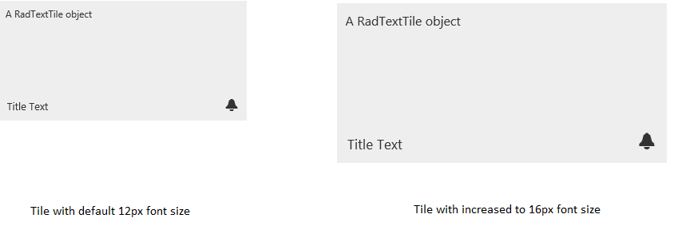

# Elastic Design


This article explains the **elastic design capabilities RadTiles offer**. The [Lightweight RenderMode]() of each RadTile supports **elastic design as of Q3 2015** (**Figure 1**).

@[template](/_templates/common/render-mode.md#resp-design-desc "slug-el: no, slug-fl: tilelist/tiles/mobile-support/fluid-design")


>caption Figure 1: Comparison between the appearance of a RadTile with regular font size and with increased font size.




**RadTiles** do not create elastic design by themselves, but can fit in a page that follows this pattern. This means that their **Lightweight RenderMode** supports **changing the font size** without breaking the control's appearance - if the new size is larger than the original, the elements in the control will simply increase their size as well to accommodate the text. This fluid layout is achieved by using `em` units for setting dimensions and paddings in the control, instead of `px`because `em` units are tied to the font size. This allows dimensions and sizes to scale with the font size.


>note **RadTiles** take the font-size of the page automatically. If the developer does not set it explicitly (**Example 1**), this is up to the client's browser and a common default value is 16px.


>caption **Example 1**: Setting default font for the page with the default value for the Telerik controls.

```CSS
body {
	font-size: 12px; /* 12px is the default value for Telerik controls */
	font-family: "Segoe UI", Arial, Sans-serif;
}
````


>caption **Example 2**: Changing the font-size of a Tile via page-level CSS rules. 

````CSS
body {
	font-size: 16px;
	font-family: "Segoe UI", Arial, Sans-serif;
}
````
````ASP.NET
<telerik:RadTextTile RenderMode="Lightweight" runat="server" ID="RadTextTile1" Selected="true" Text="A RadTextTile object" Shape="Wide">
	<Badge PredefinedType="Alert" />
	<Title Text="Title Text"></Title>
</telerik:RadTextTile>
````

>tip You can apply the CSS rule to the Tile only, or to its container if you do not want to change the entire page.

>caption **Example 3**: Changing the font-size of a Tile via the control's Font-Size property. 

````ASP.NET
<telerik:RadTextTile RenderMode="Lightweight" Font-Size="16px" runat="server" ID="RadTextTile1" Selected="true" Text="A RadTextTile object" Shape="Wide">
	<Badge PredefinedType="Alert" />
	<Title Text="Title Text"></Title>
</telerik:RadTextTile>
````


# See Also


 * [Render Modes]()

 * [Responsive Capabilities]()
