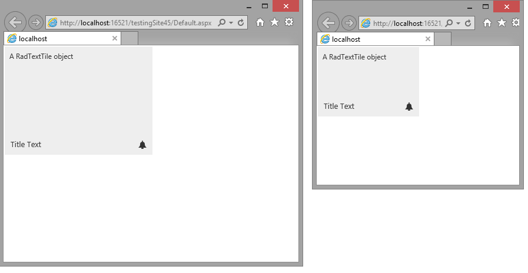

# Fluid Design


This article explains the **fluid design capabilities RadTiles offer**. The example below shows how you can set its size in percent so it can resize with its parent element.

Generally, responsive design means that the page and its content are able to adapt to different screen resolutions without deteriorating the user experience. This often includes [changing the font size](()) and having dimensions set in percent.

>caption Figure 1: A Tile with dimensions set to 100% that occupies its entire parent element




You can set the **Width** and **Height** properties of the Tile in percent. This lets it resize together with its parent element. You can find a small sample in **Example 1** that shows a simple `div` element that resizes with the browser and the tile inside resizes with it.

>caption **Example 1**: Fluid Tile with dimensions set in percent.

````
<style type="text/css">
	html, body, form
	{
		margin: 0;
		padding: 0;
		height: 100%;
	}
</style>

<div style="height: 50%; width: 50%;">
	<telerik:RadTextTile Width="100%" Height="100%" runat="server" ID="RadTextTile1" Selected="true" Text="A RadTextTile object" Shape="Wide">
		<Badge PredefinedType="Alert" />
		<Title Text="Title Text"></Title>
	</telerik:RadTextTile>
</div>
````


# See Also

* [Render Modes]()

* [Elastic Capabilities]()
