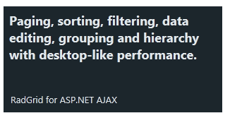

# Text Tile


## 

The __RadTextTile__ is designed to only show some text as its primary content. The string is set through its__Text__ property:

>note The examples below show specific functionality for the given tile type, for more infomration on the general options	for navigation and selecting please examine the additional resources at the end of the article.
>


__RadTileList__ example:

````ASPNET
		<telerik:RadTileList runat="server" ID="RadTileList1" Skin="Glow">
			<Groups>
				<telerik:TileGroup>
					<telerik:RadTextTile Shape="Wide" Font-Size="18px" Font-Bold="true"
						Text="Paging, sorting, filtering, data editing, grouping and hierarchy with desktop-like performance.">
						<Title Text="RadGrid for ASP.NET AJAX"></Title>
					</telerik:RadTextTile>
				</telerik:TileGroup>
			</Groups>
		</telerik:RadTileList>
````


Standalone __Tile__ example:

````ASPNET
		<telerik:RadTextTile ID="Tile1" runat="server" Shape="Wide" Font-Size="18px" Font-Bold="true"
			Text="Paging, sorting, filtering, data editing, grouping and hierarchy with desktop-like performance.">
			<Title Text="RadGrid for ASP.NET AJAX"></Title>
		</telerik:RadTextTile>
````


Where the standard properties inherited from the *WebControl* class can easily be used to change the appearanceof the text, as explained in the [Tiles configuration overview]() help article.

# See Also

 * [Tiles configuration overview]()

 * [Peek Template]()

 * [Badge and Title Elements]()

 * [Navigation]()

 * [Selecting]()
