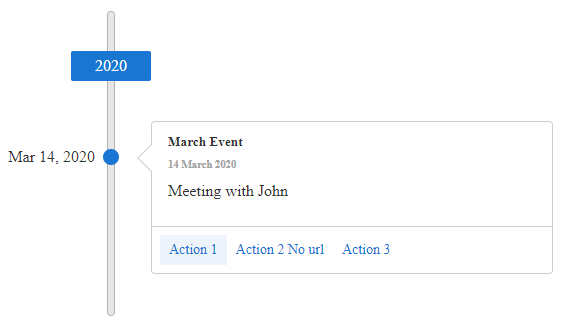

# Actions

**RadTimeline** can render links (`<a>` tags) for the items of its actions collection in the data source, giving the user the ability to navigate to specific pages.

The `Url` attribute of the `TimelineItemAction` object determines the navigation source of the action, while the `Text` - the text shown inside the action button.

The following example demonstrates how to use a field with a specific name to provide actions for the events.

>caption Figure 1: RadTimeline with several actions




You can get the result from the image above with the following setup:

````ASPNET
<telerik:RadTimeline runat="server" ID="RadTimeline1">
    <Items>
        <telerik:TimelineItem Date="2020/3/14" Title="March Event" Subtitle="14 March 2020" Description="Meeting with John">
            <Actions>
                <telerik:TimelineItemAction Text="Action 1" Url="https://google.com/search?q=action1" />
                <telerik:TimelineItemAction Text="Action 2 No url" />
                <telerik:TimelineItemAction Text="Action 3" Url="https://google.com/search?q=action3"/>
            </Actions>
        </telerik:TimelineItem>
    </Items>
</telerik:RadTimeline>
````

# See Also

 * [Overview demo](https://demos.telerik.com/aspnet-ajax/timeline/overview/defaultcs.aspx)


