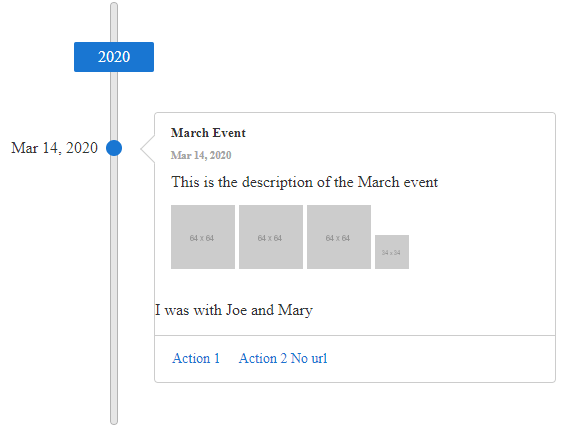

# Client-side Event Template

**RadTimeline** uses [Kendo UI Templates](https://docs.telerik.com/kendo-ui/framework/templates/overview) to provide full control over the way the events data is rendered, allowing you to customize customize them to your needs instead of using the default card.

The following example demonstrates how to customize the default `EventTemplate` of the Timeline. To render more than one image, use custom fields from your data source that will not be recognized by the default template. The classes and HTML structure in this example, except for the custom field, mimic the default card template.

You can also define custom properties, which will be later accessible through the `data.attributes` object in the template (e.g. the *Friends* property in the sample below).

>caption Figure 1: RadTimeline with custom event template



````ASPNET
<telerik:RadTimeline runat="server" ID="RadTimeline1">
    <EventTemplate>
                <div class="k-card-header">
                    <h5 class="k-card-title">#= data.title #</h5>
                    <h6 class="k-card-subtitle"><strong>#= kendo.toString(data.date, "MMM d, yyyy")#</strong></h6>
                </div>
                <div class="k-card-body">
                    <div class="k-card-description">
                        <p>#= data.description #</p>
                        <div class="imageContainer">
                            # var imagesCount = data.images? data.images.length:0;
                                for (var i = 0; i < imagesCount; i++) { #
                            
                            # } #
                        </div>
                    </div>
                </div>

            #if(data.attributes && data.attributes.Friends){#
                <p>I was with #=data.attributes.Friends#</p>
            #}#

                # var actionsCount = data.actions ? data.actions.length:0;
                if (actionsCount>0){#
                <div class="k-card-actions">
                    # for (var i = 0; i < actionsCount; i++) { #
                            <a class="k-button k-flat k-primary" href="#= data.actions[i].url #" target="_blank">#= data.actions[i].text #</a>
                    # } #
                </div>
                # } #
    </EventTemplate>
    <Items>
        <telerik:TimelineItem Date="2020/3/14" Title="March Event" Subtitle="14 March 2020" Description="This is the description of the March event" Friends="Joe and Mary">
            <Actions>
                <telerik:TimelineItemAction Text="Action 1" Url="https://google.com/search?q=action1" />
                <telerik:TimelineItemAction Text="Action 2 No url" />
            </Actions>
            <Images>
                <telerik:TimelineItemImage Src="https://via.placeholder.com/64" />
                <telerik:TimelineItemImage Src="https://via.placeholder.com/64" />
                <telerik:TimelineItemImage Src="https://via.placeholder.com/64" />
                <telerik:TimelineItemImage Src="https://via.placeholder.com/34" />
            </Images>
        </telerik:TimelineItem>
    </Items>
</telerik:RadTimeline>
````

# See Also

 * [Overview demo](https://demos.telerik.com/aspnet-ajax/timeline/overview/defaultcs.aspx)


