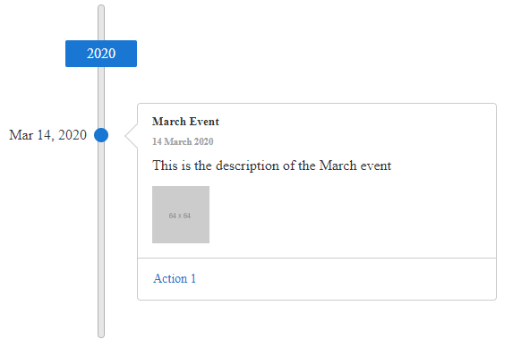

# Images

**RadTimeline** can render an `` tag for the first item of its images collection in the data source.

Its `Src` property of the `TimeLineItemImage` object will be set to the value of the src field of the image literal if RadTimeline is bound.

>caution To show more than one image, customize the [template]() of the RadTimeline.

The following example demonstrates how to configure RadTimeline declaratively, having different images insisde each `TimeLineItem`.

>caption Figure 1: RadTimeline with an image inside the item


````ASPNET
<telerik:RadTimeline runat="server" ID="RadTimeline2" Froemds="asd">
    <Items>
        <telerik:TimelineItem Date="2020/3/14" Title="March Event" Subtitle="14 March 2020" Description="This is the description of the March event">
            <Actions>
                <telerik:TimelineItemAction Text="Action 1" Url="https://google.com/search?q=action1" />
            </Actions>
            <Images>
                <telerik:TimelineItemImage Src="https://via.placeholder.com/64" />
            </Images>
        </telerik:TimelineItem>
        <telerik:TimelineItem Date="2020/3/15" Title="March Event" Subtitle="14 March 2020" Visible="false"
            Description="This is the description of the March event">
            <Actions>
                <telerik:TimelineItemAction Text="Action 1" Url="https://google.com/search?q=action1" />
            </Actions>
            <Images>
                <telerik:TimelineItemImage Src="https://via.placeholder.com/34" />
            </Images>
        </telerik:TimelineItem>
    </Items>
</telerik:RadTimeline>
````

# See Also

 * [Overview demo](https://demos.telerik.com/aspnet-ajax/timeline/overview/defaultcs.aspx)


