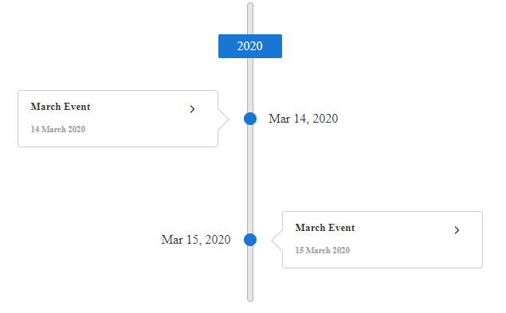
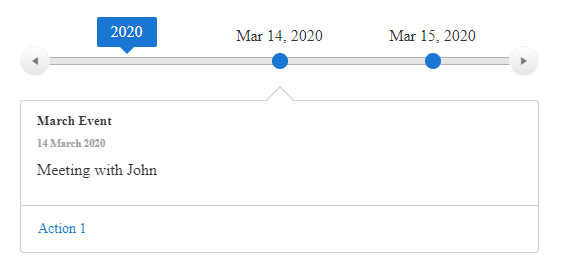

# Orientation

**RadTimeline** can render its events in  two orientation modes:
* [Vertical list](#vertical-list) and 
* [Horizontal list](#horizontal-list)


## Vertical List

By default, **RadTimeline** is vertically oriented with its events arranged on one side of the axis, having all events expanded.

You can have the events rendered alternatingly on both sides of the axis by setting its `AlternatingMode` proeprty to `true`. If you enable the `CollapsibleEvents`, all events will start out collapsed. The user can then expand a particular event by clicking on it, to see more than its title and subtitle.

>caption Figure 1: RadTimeline with Vertical orientation



You can get the result from the image above with the following setup:

````ASP.NET
<telerik:RadTimeline runat="server" ID="RadTimeline1" Orientation="Vertical" CollapsibleEvents="true" 
    EventWidth="250" AlternatingMode="true">
    <Items>
        <telerik:TimelineItem Date="2020/3/14" Title="March Event" Subtitle="14 March 2020" Description="Meeting with John">
            <Actions>
                <telerik:TimelineItemAction Text="Action 1" Url="https://google.com/search?q=action1" />
            </Actions>
        </telerik:TimelineItem>

        <telerik:TimelineItem Date="2020/3/15" Title="March Event" Subtitle="15 March 2020" Description="Meeting with Amy">
            <Actions>
                <telerik:TimelineItemAction Text="Action 2" Url="https://google.com/search?q=action2" />
            </Actions>
        </telerik:TimelineItem>
    </Items>
</telerik:RadTimeline>
````

## Horizontal List

To use the horizontal rendering, set the `Orientation` property **RadTimeline** to `Horizontal`.

In the horizontal mode, **RadTimeline** renders buttons which you can click/tap to navigate between periods. One of the events is always rendered below the time axis you can select another event to reveal its details.

The horizontal mode renders the event details on demand (only when they are selected) and is responsive (renders as many of the events as there is room on the axis for).

>caution The horizontal mode does not support alternating rendering and collapsing of events.

>caption Figure 1: RadTimeline with Horizontal orientation



You can get the result from the image above with the following setup:

````ASPNET
<telerik:RadTimeline runat="server" ID="RadTimeline2" Orientation="Horizontal">
    <Items>
        <telerik:TimelineItem Date="2020/3/14" Title="March Event" Subtitle="14 March 2020" Description="Meeting with John">
            <Actions>
                <telerik:TimelineItemAction Text="Action 1" Url="https://google.com/search?q=action1" />
            </Actions>
        </telerik:TimelineItem>

        <telerik:TimelineItem Date="2020/3/15" Title="March Event" Subtitle="15 March 2020" Description="Meeting with Amy">
            <Actions>
                <telerik:TimelineItemAction Text="Action 2" Url="https://google.com/search?q=action2" />
            </Actions>
        </telerik:TimelineItem>
    </Items>
</telerik:RadTimeline>
````

# See Also

 * [Live demo - Overview](https://demos.telerik.com/aspnet-ajax/timeline/overview/defaultcs.aspx)
 
 * [Live Demo - Horizontal Mode](https://demos.telerik.com/aspnet-ajax/timeline/horizontalmode/defaultcs.aspx)


