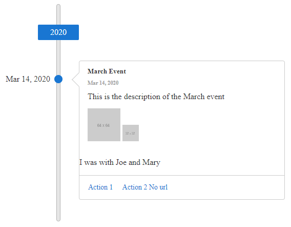

# Getting Started 

The following tutorial demonstrates how you can add a **RadTimeline** control populated with declarative items. The end result will be similar to **Figure 1**:

>caption Figure 1: Basic RadTimeline configuration with static items

1. Add a **ScriptManager** control on a Web Form.

2. Add a **RadTimeline** control to the page, and set its properties:

    * `EventTemplate` - define your own [template]() for rendering the events data by utilizing the [Kendo UI Templates](https://docs.telerik.com/kendo-ui/framework/templates/overview) functionality. You can also use the values of custom defined properties in the template.
    
    * Populate the `Items` collection with `TimelineItem` instances and set their properties:
        * `Actions` - the actions of the item, each ot them could have its own navigation `Url`
        * `Images` - the images of the item
        
    * Set other properties like `AlternatingMode`, `CollapsibleEvents`, `Height` and `Width` to control its layout and behavior as desired.
        
    The end result can be similar to the following:

    **ASPX**
    
        <telerik:RadTimeline runat="server" ID="RadTimeline1" AlternatingMode="false" CollapsibleEvents="false" Width="600px" Height="420px">
            <EventTemplate>
                     

                            <h5 class="k-card-title">#= data.title #</h5>
                            <h6 class="k-card-subtitle"><strong>#= kendo.toString(data.date, "MMM d, yyyy")#</strong></h6>
                        

                        

                            

                                
#= data.description #

                                

                                    # var imagesCount = data.images? data.images.length:0;
                                     for (var i = 0; i < imagesCount; i++) { #
                                    
                                    # } #
                                

                            

                        

                    #if(data.attributes && data.attributes.Friends){#
                        
I was with #=data.attributes.Friends#

                    #}#

                     # var actionsCount = data.actions? data.actions.length:0;
                     if (actionsCount>0){#
                        

                            # for (var i = 0; i < actionsCount; i++) { #
                                    <a class="k-button k-flat k-primary" href="#= data.actions[i].url #" target="_blank">#= data.actions[i].text #</a>
                                    # } #
                        

                     #}#
            </EventTemplate>
            <Items>
                <telerik:TimelineItem Date="2020/3/14" Title="March Event" Subtitle="14 March 2020" Description="This is the description of the March event" Friends="Joe and Mary">
                    <Actions>
                        <telerik:TimelineItemAction Text="Action 1" Url="https://google.com/search?q=action1" />
                        <telerik:TimelineItemAction Text="Action 2 No url" />
                    </Actions>
                    <Images>
                        <telerik:TimelineItemImage Src="https://via.placeholder.com/64" />
                        <telerik:TimelineItemImage Src="https://via.placeholder.com/32" />
                    </Images>
                </telerik:TimelineItem>
            </Items>
        </telerik:RadTimeline>
