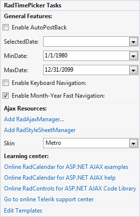
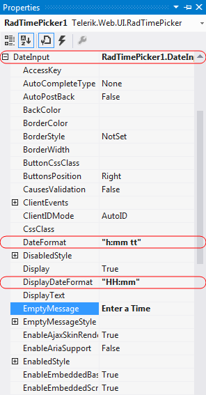
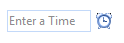

# Getting Started Overview

This tutorial will walk you through creating a Web page that uses **RadTimePicker** control. It shows how to:

* Use a **RadTimePicker** control

* Apply skins to change the overall look and feel of the control

* Apply styles to tweak the appearance of the controls.

* Configure the selection and navigation behavior of the **RadCalendar** control.

* Add messages to appear when nothing is entered in the **RadTimePicker**.

* Specify formats for display and editing.

## Adding a RadTimePicker control

1. Drag a **RadTimePicker** control from the toolbox onto your Web page,below the **RadDateTimePicker** control.

2. In the **RadTimePicker** properties pane, set the **Skin** property to "Outlook" so that it matches the **RadCalendar** and **RadDatePicker** controls:

3. In the **Behavior** section of the properties pane, expand the **DateInput** property and configure the embedded **RadDateInput** control:
    * Set the **DateFormat** property to "h:mm tt". This is the format string for when embedded **RadDateInput** control has focus (when the user can enter its value).
    * Set the **DisplayDateFormat** property to "HH:mm". This causes the embedded **RadDateInput** control to format its value using a 24-hour clock when it does not have focus.
    * Set the **EmptyMessage** property to " Enter a Time ", providing a prompt when the value of the **RadTimePicker** control has not been set.
    
    

4. Expand the **TimeView** property. This lets you configure the properties of the embedded **RadTimeView** control that acts as a popup for choosing time values. Set its **BackColor** property to "#DDEEFF", just like you did for the **RadDateTimePicker** control.

## Running the application

1. Run the application. The **RadTimePicker** control shows an empty message, because no value has been assigned yet. The "Outlook" skin is used by the control.

2. Select a time value for the **RadTimePicker** control. Note the formatting changes depending on whether the controls have focus.

# See Also

 * [RadTimePicker Structure]()

