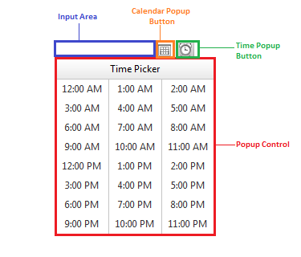

# RadTimePicker Structure


The **RadDateTimePicker** control is composite controls that combine the functionality of **RadCalendar** and **RadTimeView** with the functionality of **RadDateInput** to give the broadest possible range of options for selecting date and time values. The three controls have the same basic structure:


The three major components of a **RadDatePicker**, **RadTimePicker** or **RadDateTimePicker** control are:

* **InputArea** - This is an embedded **RadInput** control, which validates dates or times as the user types.

* **Popup Control** - This is a **RadCalendar** and **RadTimeView** control that is shown in a popup element, so that the user can select a date or time by clicking on the desired selection.

* **Calendar Popup Button** and **Time Popup Button** - an image button, displayed next to the input area that shows and hides the popup control.

>caution 
If the popup control is a **RadCalendar** control it must have **AutoPostBack** set to **False** in order to work properly. This means that a popup calendar cannot be used in multi-view mode.
>


Since **RadDatePicker** does not recognize other **Time Popups** excepts its own,it closes only the **Calendar Popups**. The following script can be added in order to allow the **RadDatePicker** to close all of the currently open Time Popups on the page:

````JavaScript
<script type="text/javascript">
    Telerik.Web.UI.RadDatePicker.prototype._actionBeforeShowPopup_original = Telerik.Web.UI.RadDatePicker.prototype._actionBeforeShowPopup;
    Telerik.Web.UI.RadDatePicker.prototype._actionBeforeShowPopup = function () {
        this._actionBeforeShowPopup_original();
        if (Telerik.Web.UI.RadDateTimePicker) {
            Telerik.Web.UI.RadDateTimePicker.prototype._hideAllTimePopups();
        }
    }
</script>
````


# See Also

 * [RadCalendar Structure]()

 * [RadTimeView Structure]()
