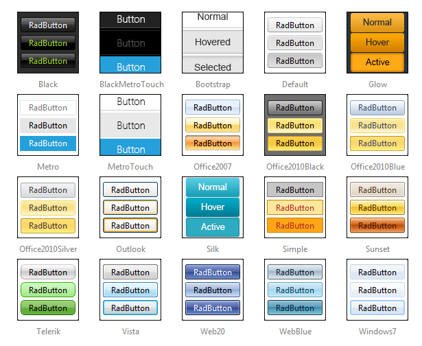

# Skins

**RadToggleButton** uses **skins** to control its overall look-and-feel. A skin is a set of images and a CSS stylesheet that can be applied to the control elements and defines their look and feel.

To apply a skin to a **RadToggleButton** control, set its **Skin** property.

**RadToggleButton** is installed with a number of preset skins. These are shown below:

## Using Custom Images in a State

**RadToggleButton** allows the developer to use a [custom image for a state](). Once this is done, the entire control is considered a custom image and it will no longer have the default push button appearance (border and backgrounds). Thus, if you mix push button states and image states, the push button states will look like plain text on the page.

## Customizing Skins

You can tweak the existing skins or create your own. See [Create a Custom Skin For RadToggleButton]() for a step-by-step walk through. To use your own skin

1. Add the new CSS file to your project.

1. Drag and drop the CSS file from the Project Explorer onto your Web page.

1. Set the **EnableEmbeddedSkins** property of the control to **False**.

The stylesheet for a **RadToggleButton** skin has the name **Button.[SkinName].css** and can be found in the **...Skins/[SkinName]** directory. For example, the stylesheet for the "Black" skin is called Button.Black.css and is located in the ...Skins/Black directory.

## See Also

 * [Create a Custom Skin]()

 * [Primary and Secondary Action Buttons]()
 
 * [Image]()
