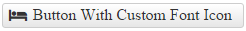

# Custom Icons

This help article shows how to use custom icons (images or font icons) in **RadToggleButton**.

* [Image Icons](#image-icons)

* [Font Icons](#font-icons)

## Image Icons

To display an image icon on the **RadToggleButton**, you need to set the desired **ButtonToggleState**'s **Icon.Url** property to point to the URL of the desired image.

>caption Figure 1: RadToggleButton with custom icon set through the **Icon.Url** property of each **ButtonToggleState**.


>caption Example 1: Configure a **RadToggleButton** with an icon through the **Icon.Url** property.

````ASP.NET
<telerik:RadToggleButton ID="RadToggleButton1" runat="server" Text="Button With Custom Image Icon">
	<ToggleStates>
		<telerik:ButtonToggleState>
			<Icon Url="http://demos.telerik.com/aspnet-ajax/button/examples/customicons/images/eFind.png" Top="5" Left="8" />
		</telerik:ButtonToggleState>
		<telerik:ButtonToggleState>
			<Icon Url="http://demos.telerik.com/aspnet-ajax/button/examples/customicons/images/eFlash.png" Top="5" Left="8" />
		</telerik:ButtonToggleState>
	</ToggleStates>
</telerik:RadToggleButton>
````

### Hovered and Active States

**RadToggleButton** also provides an easy way to show different icons when the mouse is over the control, or the button is pressed (see **Figure 2** and **Example 2**). To do this, use the **HoveredCssClass** and **PressedCssClass** properties exposed by the **Icon** tag of each toggle state.

>caption Figure 2: A RadToggleButton can have different icons for its normal, hovered and active states.


**Example 2:** Setup unique icons for the normal, hovered and active states of a **RadToggleButton**.

````ASP.NET
<telerik:RadToggleButton ID="RadToggleButton1" runat="server" Text="Normal Hover Active State Icons">
	<ToggleStates>
		<telerik:ButtonToggleState>
			<Icon Url="http://demos.telerik.com/aspnet-ajax/button/examples/customicons/images/ePlayer.png"
				HoveredUrl="http://demos.telerik.com/aspnet-ajax/button/examples/customicons/images/eFlash.png"
				PressedUrl="http://demos.telerik.com/aspnet-ajax/button/examples/customicons/images/eTime.png" />
		</telerik:ButtonToggleState>
		<telerik:ButtonToggleState>
			<Icon Url="http://demos.telerik.com/aspnet-ajax/button/examples/customicons/images/eFlash.png" Top="5" Left="8" />
		</telerik:ButtonToggleState>
	</ToggleStates>
</telerik:RadToggleButton>
````

## Font Icons

You can use custom font icons in **RadToggleButton** as well. To do that, follow the steps below:

1. Load the stylesheet with the desired font icons on the page.

	**CSS**

		<link rel="stylesheet" href="myCustomFontStyleSheet.css" />

1. Override the font-family of the button's icon element with the target one (see **Example 3**).

	**CSS**

		button.RadButton .rbIcon:before {
			font-family: myCustomFont;
		}

1. Set the custom font icon class to the **Icon.CssClass** property of the desired toggle state.

	**ASP.NET**

		<telerik:RadToggleButton ID="RadToggleButton1" runat="server" Text="Button With Custom Font Icon">
			<ToggleStates>
				<telerik:ButtonToggleState>
					<Icon CssClass="myCustomFontIconClass1" />
				</telerik:ButtonToggleState>
				<telerik:ButtonToggleState>
					<Icon CssClass="myCustomFontIconClass2" />
				</telerik:ButtonToggleState>
			</ToggleStates>
		</telerik:RadToggleButton>

Below you can find an example with [Font Awesome Icons](https://fortawesome.github.io/Font-Awesome/icons/).

>caption Figure 3: RadToggleButton with Font Awesome icons.



**Example 3:** Using FontAwesome font icons in RadToggleButton.

````CSS
<link rel="stylesheet" href="//maxcdn.bootstrapcdn.com/font-awesome/4.3.0/css/font-awesome.min.css" />
<style>
	button.RadButton.fa .rbIcon:before {
		font-family: FontAwesome;
	}
</style>
````

````ASP.NET
<telerik:RadToggleButton ID="RadToggleButton1" runat="server" Text="Button With Custom Font Icon" CssClass="fa">
	<ToggleStates>
		<telerik:ButtonToggleState>
			<Icon CssClass="fa-bed" />
		</telerik:ButtonToggleState>
		<telerik:ButtonToggleState>
			<Icon CssClass="fa-clock-o" />
		</telerik:ButtonToggleState>
	</ToggleStates>
</telerik:RadToggleButton>
````

You can also change the font-size and color of the font icon as described in the [Fine Tune]() help article.

## See Also

 * [RadToggleButton Overview Demo](http://demos.telerik.com/aspnet-ajax/togglebutton/overview/defaultcs.aspx)
 
 * [Font Awesome Icons](https://fortawesome.github.io/Font-Awesome/icons/)
 
 * [Icons Overview]()
 
 * [Fine Tune Icons Position, Size and Color]()
 
 
