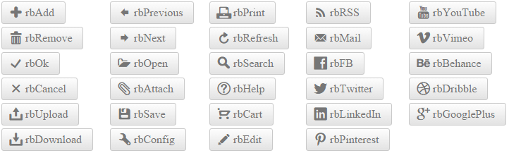
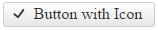
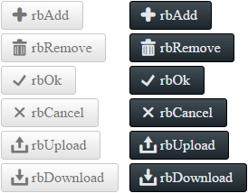

# Embedded Icons

This help article shows how to use embedded icons in **RadToggleButton**, lists the necessary CSS classes and describes the skins specifics.

* [Configuration](#configuration)

* [CssClass List of Embedded Icons](#cssclass-list-of-embedded-icons)

* [Skins Specifics](#skins-specifics)

>caption Figure 1: List of Embedded icons in RadToggleButton.



You can also use [custom icons]() (image or font icons) and [fine-tune their position, color and size]().

## Configuration

To make the control easier to use, **Telerik** provides a large set of built-in icons (**Figure 1**). To use them, set the **Icon.CssClass** property of each **ButtonToggleState** (**Example 1**) to one of the predefined [CSS class names](#cssclass-list-of-embedded-icons), and the respective icon will be shown on the control.

>caption Figure 2: RadToggleButton with an embedded icon (ButtonToggleState.Icon.CssClass="rbOk") from Example 1.



>caption Example 1: Declaration of embedded icons in RadToggleButton states.

````ASP.NET
<telerik:RadToggleButton runat="server" ID="RadToggleButton1" Text="Button with Icon">
	<ToggleStates>
		<telerik:ButtonToggleState Selected="true">
			<Icon CssClass="rbOk" />
		</telerik:ButtonToggleState>
		<telerik:ButtonToggleState>
			<Icon CssClass="rbCancel" />
		</telerik:ButtonToggleState>
	</ToggleStates>
</telerik:RadToggleButton>
````

## CssClass List of Embedded Icons

You can find below the full list of CSS classes responsible for the embedded icons in **RadToggleButton**. The **CssClass** is composed in the following way: [**r**]ad[**b**]utton[**IconName**]. For example **rbAdd**.

|  |  |  |  |  |
| ------ | ------ | ------ | ------ | ------ |
|rbAdd|rbPrevious|rbPrint|rbRSS|rbYouTube |
|rbRemove|rbNext|rbRefresh|rbMail|rbVimeo |
|rbOk|rbOpen|rbSearch|rbFB|rbBehance |
|rbCancel|rbAttach|rbHelp|rbTwitter|rbDribble |
|rbUpload|rbSave|rbCart|rbLinkedIn |rbGooglePlus|
|rbDownload|rbConfig|rbEdit|rbPinterest||

<!-- The above table can also be shown as a list:
* rbAdd
* rbRemove
* rbOk
* rbCancel
* rbUpload
* rbDownload
* rbPrevious
* rbNext
* rbOpen
* rbAttach
* rbSave
* rbConfig
* rbPrint
* rbRefresh
* rbSearch
* rbHelp
* rbCart
* rbEdit
* rbRSS
* rbMail
* rbFB
* rbTwitter
* rbLinkedIn 
* rbPinterest 
* rbYouTube 
* rbVimeo 
* rbBehance 
* rbDribble 
* rbGooglePlus
-->

## Skins Specifics

The color of the predefined icons can be white or black, depending on the chosen Skin. You can see the difference for the **Silk** and **Glow** skin in **Figure 3**.

>caption Figure 3: Embedded icons in RadToggleButton for the Silk and Glow skin have white and black colors.



<!-- The code that creates Figure 3 is available in examples/DefaultCS.aspx page
-->


## See Also

 * [Fine-tune Icons]()
 
 * [Custom Icons]()

 * [RadToggleButton Overview Demo](http://demos.telerik.com/aspnet-ajax/togglebutton/overview/defaultcs.aspx)

 