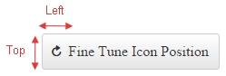
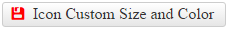

# Fine-tune Icons

This help article shows how to modify the position, size and color of icons in **RadToggleButton**.

* [Fine-tune Position](#fine-tune-position)

* [Configure Font-size and Color](#configure-font-size-and-color)

## Fine-tune Position

You can change the position of font or image icons to match your concrete requirements. To do this, use the `Icon.Top` and `Icon.Left` properties to directly offset the icon in the particular toggle state (**Example 1**).

>caption Figure 1: The icon in RadToggleButton can be offset from its original top and left position. See Example 1.



>caption Example 1: Offset RadToggleButton Icon from the top and left. You can see the result in Figure 1.

````ASP.NET
<telerik:RadToggleButton ID="RadToggleButton1" runat="server" Text="Fine Tune Icon Position" Height="40px">
	<ToggleStates>
		<telerik:ButtonToggleState>
			<Icon CssClass="rbRefresh" Top="10px" Left="7px" />
		</telerik:ButtonToggleState>
		<telerik:ButtonToggleState>
			<Icon CssClass="rbSave" Top="10px" Left="7px" />
		</telerik:ButtonToggleState>
	</ToggleStates>
</telerik:RadToggleButton>
````

## Configure Font-size and Color

The embedded **RadToggleButton** icons are font icons. Using a font facilitates the customization of the icons. For example, you can change the icons color and font size with a single line of CSS (see **Figure 2** and **Example 2**).

>caption Figure 2: Customize the font size and color of the embedded icons of RadToggleButton with CSS.



>caption Example 2: Use CSS to modify the font size and color of the embedded icons in RadToggleButton.

````CSS
<style type="text/css">
	button.RadButton.customizeIcon .rbPrimaryIcon:before {
		color: red;
		font-size: 17px;
	}
</style>
````

````ASP.NET
<telerik:RadToggleButton ID="RadToggleButton2" runat="server" Text="Icon Custom Size and Color" CssClass="customizeIcon">
	<ToggleStates>
		<telerik:ButtonToggleState>
			<Icon CssClass="rbSave" />
		</telerik:ButtonToggleState>
		<telerik:ButtonToggleState>
			<Icon CssClass="rbRefresh" />
		</telerik:ButtonToggleState>
	</ToggleStates>
</telerik:RadToggleButton>
````

>tip This also applies for [custom font icons](#font-icons).

## See Also

 * [Icons Overview]()

 * [Custom Icons]()

 * [RadToggleButton Overview Demo](http://demos.telerik.com/aspnet-ajax/togglebutton/overview/defaultcs.aspx)
 
 


 