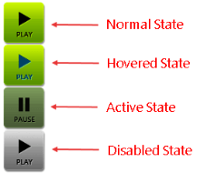

# Image

This help article illustrates how to configure **RadToggleButton** with images for its different states.

## Configuration

To define an image in **RadToggleButton** you should set the path to the image inside the **Image.Url** property of each toggle state (**Example 1**). You can also show text over the image by simply setting it in the **Text** property.

You can control the image dimensions through the **Width** and **Height** properties which are exposed globally (the **RadToggleButton** object) as well as per each toggle state (the **ButtonToggleState** objects).

>caption Figure 1: RadToggleButton with image.


>caption Example 1: Configure images inside toggle states of RadToggleButton. 

````ASP.NET
<telerik:RadToggleButton runat="server" ID="RadToggleButton1" Width="100px" Height="60px">
	<ToggleStates>
		<telerik:ButtonToggleState Selected="true">
			<Image Url="http://demos.telerik.com/aspnet-ajax/button/examples/togglebutton/images/volume/low.png" />
		</telerik:ButtonToggleState>
		<telerik:ButtonToggleState>
			<Image Url="http://demos.telerik.com/aspnet-ajax/button/examples/togglebutton/images/volume/high.png" />
		</telerik:ButtonToggleState>
		<telerik:ButtonToggleState>
			<Image Url="http://demos.telerik.com/aspnet-ajax/button/examples/togglebutton/images/volume/mute.png" />
		</telerik:ButtonToggleState>
	</ToggleStates>
</telerik:RadToggleButton>
```` 

>note The Background-size of the image is controlled through the **Image.Sizing** property.

## Hovered, Active and Disabled States

**RadToggleButton** also provides an easy way to show different images when the mouse is over the control, the button is pressed or disabled (see **Figure 2** and **Example 2**). To do this, use the **PressedUrl**, **HoveredUrl**, **DisabledUrl** properties exposed by the **Image** tag of each toggle state.

>caption Figure 2: A RadToggleButton can have different images for its normal, hovered, active and disabled state.



>caption Example 2: Setup unique images for the normal, hovered, active and disabled state of a RadToggleButton.

````ASP.NET
<telerik:RadToggleButton runat="server" ID="RadToggleButton1" Width="58px" Height="59px">
	<ToggleStates>
		<telerik:ButtonToggleState Selected="true">
			<Image Url="http://demos.telerik.com/aspnet-ajax/button/examples/togglebutton/images/play/play.png" HoveredUrl="http://demos.telerik.com/aspnet-ajax/button/examples/togglebutton/images/play/playHov.png" PressedUrl="http://demos.telerik.com/aspnet-ajax/button/examples/togglebutton/images/play/pause.png" DisabledUrl="http://demos.telerik.com/aspnet-ajax/button/examples/imagebutton/images/cb_play_d.png" />
		</telerik:ButtonToggleState>
		<telerik:ButtonToggleState>
			<Image Url="http://demos.telerik.com/aspnet-ajax/button/examples/togglebutton/images/play/pause.png" />
		</telerik:ButtonToggleState>
	</ToggleStates>
</telerik:RadToggleButton>
````

## See Also

 * [Select State]()
 
 * [Custom Icons]()
 
 * [Server-Side API]()

