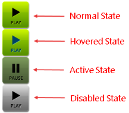

# Image

This help article illustrates how to put an **image** in a toggle state on a **RadToggleButton**.

To define an image in a **RadToggleButton** you should set the path to the image inside the **Image.Url** property of each toggle state (**Example 1**). You can also show text over the image by simply setting it in the **Text** property.

You can control the image dimensions through the **Width** and **Height** properties, which are exposed globally (the **RadToggleButton** object) as well as in each toggle state (the **ButtonToggleState** objects).

>caption Figure 1: RadToggleButton with image.


>caption Example 1: Configure images inside toggle states of RadToggleButton. 

````ASP.NET
<telerik:RadToggleButton runat="server" ID="RadToggleButton1" Width="100px" Height="60px">
	<ToggleStates>
		<telerik:ButtonToggleState Selected="true">
			<Image Url="https://demos.telerik.com/aspnet-ajax/button/examples/togglebutton/images/volume/low.png" />
		</telerik:ButtonToggleState>
		<telerik:ButtonToggleState>
			<Image Url="https://demos.telerik.com/aspnet-ajax/button/examples/togglebutton/images/volume/high.png" />
		</telerik:ButtonToggleState>
		<telerik:ButtonToggleState>
			<Image Url="https://demos.telerik.com/aspnet-ajax/button/examples/togglebutton/images/volume/mute.png" />
		</telerik:ButtonToggleState>
	</ToggleStates>
</telerik:RadToggleButton>
```` 

>tip The Background-size of the image is controlled through the **Image.Sizing** property.

>note If you add toggle states with and witout images, the RadToggleButton control will no longer be considered a button but a custom image. Thus, the borders and default backgrounds of the non-image toggle state will be lost and the appearance of the control will change.

## Hovered, Active (Pressed) and Disabled States

**RadToggleButton** also provides an easy way to show different images when the mouse is hovered over the control, the button is pressed or the button is disabled (see **Figure 2** and **Example 2**). To do this, use the **HoveredUrl**, **PressedUrl** and **DisabledUrl** properties exposed by the **Image** tag of each toggle state.

>caption Figure 2: A RadToggleButton can have different images for its normal, hovered, active (pressed) and disabled state.



>caption Example 2: Setup unique images for the normal, hovered, active (pressed) and disabled state of a RadToggleButton.

````ASP.NET
<telerik:RadToggleButton runat="server" ID="RadToggleButton1" Width="58px" Height="59px">
	<ToggleStates>
		<telerik:ButtonToggleState Selected="true">
			<Image Url="https://demos.telerik.com/aspnet-ajax/button/examples/togglebutton/images/play/play.png" HoveredUrl="https://demos.telerik.com/aspnet-ajax/button/examples/togglebutton/images/play/playHov.png" PressedUrl="https://demos.telerik.com/aspnet-ajax/button/examples/togglebutton/images/play/pause.png" DisabledUrl="https://demos.telerik.com/aspnet-ajax/button/examples/imagebutton/images/cb_play_d.png" />
		</telerik:ButtonToggleState>
		<telerik:ButtonToggleState>
			<Image Url="https://demos.telerik.com/aspnet-ajax/button/examples/togglebutton/images/play/pause.png" />
		</telerik:ButtonToggleState>
	</ToggleStates>
</telerik:RadToggleButton>
````

## See Also

 * [Select State]()
 
 * [Custom Icons]()
 
 * [Server-Side API]()

