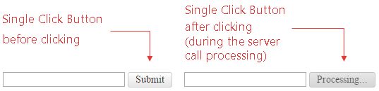

# Single Click

The single click button (**Figure 1**) is used to avoid multiple postbacks to the server. This feature is useful in database and/or e-mail send scenarios when the developer should prevent submitting of identical content multiple times to the server.

>caption Figure 1: RadToggleButton with SingeClick functionality before and after click.



The following properties should be used to enable the single click functionality:

* **SingleClick** - determines whether the **RadToggleButton** control will be immediately disabled after the user clicks it. Set it to **true** to enable the single click functionality.

* **SingleClickText** - determines the text displayed in the **RadToggleButton** control after the button is being clicked and disabled. The original text will be retrieved after the server request execution. The property takes a plain text string.

>caption Example 1: The code that enables the single click functionality in **RadToggleButton** from **Figure 1**.

````ASP.NET
<asp:TextBox ID="txtName" runat="server" />

<telerik:RadToggleButton runat="server" ID="RadToggleButton1" SingleClick="true" SingleClickText="Processing..." OnToggleStateChanged="RadToggleButton1_ToggleStateChanged">
	<ToggleStates>
		<telerik:ButtonToggleState Text="State 1">
		</telerik:ButtonToggleState>
		<telerik:ButtonToggleState Text="Submit" Selected="true">
		</telerik:ButtonToggleState>
		<telerik:ButtonToggleState Text="State 3">
		</telerik:ButtonToggleState>
	</ToggleStates>
</telerik:RadToggleButton>

<asp:Label ID="lblGreeting" runat="server" />
````

````C#
protected void RadToggleButton1_ToggleStateChanged(object sender, Telerik.Web.UI.ToggleButtonStateChangedEventArgs e)
{
	if (Page.IsPostBack) System.Threading.Thread.Sleep(3000);
	lblGreeting.Text = String.Format("Hello, {0}!", txtName.Text);
}
````
````VB
Protected Sub RadToggleButton1_ToggleStateChanged(sender As Object, e As Telerik.Web.UI.ToggleButtonStateChangedEventArgs) Handles RadToggleButton1.ToggleStateChanged
	If Page.IsPostBack Then
		System.Threading.Thread.Sleep(3000)
	End If
	lblGreeting.Text = String.Format("Hello, {0}!", txtName.Text)
End Sub
````

The submitted text in processed on the server-side. Note that the method **System.Threading.Thread.Sleep**	is used so that the disabled button can be examined after clicking it.

## See Also

 * [Select State]()
