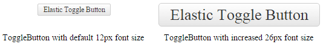

# Elastic Design

This article explains the **elastic design capabilities that RadToggleButton offers**. 

**RadToggleButton** supports an elastic design which means the control and its elements can be resized according to a predefined font size. This is achieved by configuring a particular font-size of the button on the page. You can test the elastic design of the **RadToggleButton** with **Example 1**. 

>tip The elastic design of the **RadToggleButton** is part of its responsive design (*i.e, the page and its content are able to adapt to different screen resolutions without deteriorating the user experience*) which also includes a fluid design. You can read more information about the fluid design of **RadToggleButton** in the  [Fluid Design]() article.

>caption Figure 1: Comparison between appearance of a RadToggleButton with regular font size and with increased font size.



>caption Example 1: Shows how to increase the font size of a RadToggleButton in Figure 1.

````CSS
<style type="text/css">
	button.RadButton {
		font-size: 26px;
	}
</style>
````

````ASP.NET
<telerik:RadToggleButton runat="server" ID="RadToggleButton1" Text="Elastic Toggle Button">
	<ToggleStates>
		<telerik:ButtonToggleState Text="State 1"/>
		<telerik:ButtonToggleState Text="State 2" /> 
	</ToggleStates>
</telerik:RadToggleButton>
````

## See Also

 * [Mobile Support Overview]()

 * [Render Modes]()

 * [Fluid Design]()

