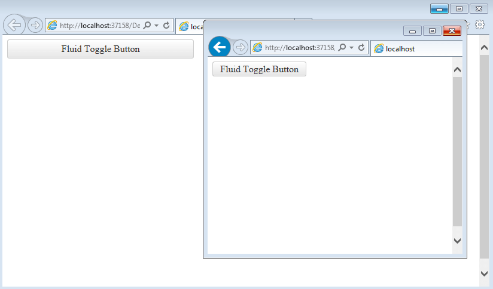

# Fluid Design

This article explains the **fluid design capabilities that RadToggleButton offers**. 

**RadToggleButton** supports a fluid design which means the control can adapt to the width of the current screen resolution. This is achieved by defining percentage in its `Width` property. You can test the fluid design of the **RadToggleButton** with **Example 1**. 

>tip The fluid design of the **RadToggleButton** is part of its responsive design (*i.e, the page and its content are able to adapt to different screen resolutions without deteriorating the user experience*) which also includes elastic design. You can read more information about the elastic design of **RadToggleButton** in the  [Elastic Design]() article.

>caption Figure 1: RadToggleButton set to 100% width and 25% height.



>caption Example 1: Shows the markup that provides fluid design of the RadToggleButton in Figure 1.

````ASP.NET
<style>
    html, body, form {
        height: 100%;
    }
</style>

<div style="width: 40%; height: 30%;">
    <telerik:RadToggleButton runat="server" ID="ToggleButton1"
        Text="Fluid Toggle Button" Width="100%" Height="25%">
			<ToggleStates>
				<telerik:ButtonToggleState Text="State 1"/>
				<telerik:ButtonToggleState Text="State 2" /> 
			</ToggleStates>
    </telerik:RadToggleButton>
</div>
````

## See Also

 * [Mobile Support Overview]()

 * [Render Modes]()

 * [Elastic Design]()

