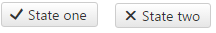

# ToggleButton Overview

**RadToggleButton** (**Figure 1**) lets you define several [states]() the button will go through as the user clicks it. Additionally, it provides events, supports Commands, lets you [define icons]() or [images]() in those states, and has a [mechanism to prevent multiple postbacks](). **RadToggleButton** is available as of **Q1 2016**.

The control can be easily styled by changing the **[Skin]()** property or any of the properties that control the icons/images in its states.


>caption Figure 1: RadToggleButton with two states.



>caption Example 1: A basic example of different states in a RadToggleButton

````ASP.NET
<telerik:RadToggleButton runat="server" ID="RadToggleButton1">
	<ToggleStates>
		<telerik:ButtonToggleState Text="State one">
			<Icon CssClass="rbOk" />
		</telerik:ButtonToggleState>
		<telerik:ButtonToggleState Text="State two">
			<Icon CssClass="rbCancel" />
		</telerik:ButtonToggleState>
	</ToggleStates>
</telerik:RadToggleButton>
````

>note **RadToggleButton** does not support a Classic [render mode](). Setting its RenderMode to Classic will default to the Lightweight render mode.

## See Also

 * [RadToggleButton Online Demos](http://demos.telerik.com/aspnet-ajax/togglebutton/overview/defaultcs.aspx)
 
 * [RadToggleButton Getting Started]()
 
 * [RadToggleButton Select State]()
 
 * [RadToggleButton Properties and Events]()
 