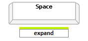
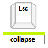
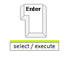

# Keyboard Support

A critical requirement for software accessibility is keyboard support as a complete alternative to pointing devices (mouse, etc.). Keyboard support is comprised of navigation key, command key, keyboard navigation, and keyboard shortcuts. RadToolBar seamlessly switches between mouse and keyboard navigation.


## KeyboardNavigationSettings

Setting the control's **KeyboardNavigationSettings**, allows you to associate an activation combination (**CommandKey** + **FocusKey**), which moves focus to a particular item of the RadToolBar and enables keyboard navigation. When there are multiple ToolBars on a given page, each of them may have a different activation combination.

The **KeyboardNavigationSettings** exposes two properties to configure the keyboard combination that sets focus to the control: 

* **FocusKey**: An upper-case letter or number.

* **CommandKey**: [Ctrl] , [Alt] or [Shift].

Pressing the keys set to these two properties at the same time places the focus on the ToolBar. The user can then use the arrow keys for navigation. 

**Example 1**: Setting the KeyboardNavigationSettings for **RadToolBar**

````ASPNET
<telerik:RadToolBar RenderMode="Lightweight" ID="RadToolBar1" runat="server" >
    <KeyboardNavigationSettings CommandKey="Alt" FocusKey="M" />
</telerik:RadToolBar>
````

>note Note that in some browsers certain keyboard combinations are already occupied and used by the browser itself. 
>


## Moving through the buttons

Keyboard navigation is supported by using the arrow keys. Use the [CommandKey] + [FocusKey] to move focus to the first button in the ToolBar. Then use the arrow keys to move among the buttons.


## Drop-down lists

Drop-down lists are expanded using the arrow keys in the direction in which they expand: for example, in a horizontal ToolBar, drop-down lists are expanded using the [Down arrow key]. In a vertical ToolBar, the [Right arrow key] expands a drop-down list (unless right-to-left support is enabled, in which case the [Left arrow key] expands a drop-down list). Drop-down lists can also be expanded by using the [Space] key.
 

Drop-down lists are contracted using the [ESC] key. They can also be contracted by navigating to the first item in the list and then using the arrow key in the opposite direction from the one that expands the list.



## Executing buttons

When focus is on a button in the ToolBar, pressing the [ENTER] key causes the button to execute (triggers the client- and server-side click events):


