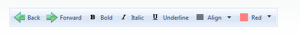

# Adding Images to Buttons

## 

Each **RadToolBarItem** has a set of properties you can use to add images to the buttons in your toolbar. You can simply add a single image to each button, or you can add separate images that reflect the state of the button.

The following properties let you add images to toolbar buttons:

* **ImageUrl** specifies an image that is added to the button. This image is always used, unless you set one of the other properties to specify an alternate image to use in a specific state.

* **HoveredImageUrl** specifies an image that is used when the mouse is over the button.

* **ClickedImageUrl** specifies an image that is used when the user clicks the button.

* **FocusedImageUrl** specifies an image that is used when the button has input focus.

* **DisabledImageUrl** specifies an image that is used when the button is disabled.

* **CheckedImageUrl** (**RadToolBarButton** only) specifies an image that is used when the button is checked.

The **ImagePosition** property specifies where the image appears relative to the text of the button. The possible values are

* "Left"

* "Right"

* "AboveText"

* "BelowText"

>caution The **ImagePosition** property only affects the position of images in the toolbar. For buttons that appear in drop-down lists, the image always appears to the left of the text.
>


To set the image properties at design time, use the [RadToolBar Item Builder]().

The following example adds images (in various positions) to the buttons in a toolbar. Note that the split button takes its image (and text) from the default button in its drop-down list, but uses its own setting for the **ImagePosition** property:



````ASPNET
<telerik:RadToolBar ID="RadToolBar1" runat="server" Skin="Telerik">
    <Items>
        <telerik:RadToolBarButton runat="server" ClickedImageUrl="~/Images/backClicked.gif"
            ImageUrl="~/Images/back.gif" Text="Back">
        </telerik:RadToolBarButton>
        <telerik:RadToolBarButton runat="server" ClickedImageUrl="~/Images/forwardClicked.gif"
            ImagePosition="Right" ImageUrl="~/Images/forward.gif" Text="Forward">
        </telerik:RadToolBarButton>
        <telerik:RadToolBarDropDown runat="server" ImagePosition="BelowText" ImageUrl="~/Images/search.gif"
            Text="Search">
            <Buttons>
                <telerik:RadToolBarButton runat="server" ImageUrl="~/Images/file.gif" Text="File" />
                <telerik:RadToolBarButton runat="server" ImageUrl="~/Images/Selection.gif" Text="Selection" />
                <telerik:RadToolBarButton runat="server" ImageUrl="~/Images/Project.gif" Text="Entire Project" />
            </Buttons>
        </telerik:RadToolBarDropDown>
        <telerik:RadToolBarSplitButton runat="server" ImagePosition="AboveText">
            <Buttons>
                <telerik:RadToolBarButton runat="server" ImageUrl="~/Images/print.gif" Text="Print">
                </telerik:RadToolBarButton>
                <telerik:RadToolBarButton runat="server" ImageUrl="~/Images/Mark.gif" Text="Mark">
                </telerik:RadToolBarButton>
            </Buttons>
        </telerik:RadToolBarSplitButton>
    </Items>
</telerik:RadToolBar>
````


>tip You can create image-only buttons in your toolbar by setting the Text property to an empty string.
>


Since Q3 2010 RadToolBar provides support for sprites - two new properties have been added:EnableImageSprites for the whole toolbar and EnableImageSprite for every toolbar button. Their purpose is to replace the toolbar button image element with a sized span for easier use of sprites. CssClass property of the buttons should be set in order to apply the sprite background image:

````ASPNET
<style type="text/css">

    .icon1 .rtbIcon,
    .icon2 .rtbIcon {
      background: transparent url('sprite.png') 0 0;
    }
    .icon2 .rtbIcon {
      background-position: -16px 0;
    }
</style>
<telerik:RadToolBar ID="RadToolBar1" runat="server" EnableImageSprites="true">
   <Items>
       <telerik:RadToolBarButton Text="Button1" CssClass="icon1" />
       <telerik:RadToolBarButton Text="Button2" CssClass="icon2" />
       <telerik:RadToolBarButton Text="Button3" EnableImageSprite="false" />
   </Items>
</telerik:RadToolBar> 
````

will be rendered like this:

````HTML
<ul class="rtbUL">
    <li class="rtbItem rtbBtn ">
     <a class="icon1 rtbWrap" href="#">
      <span class="rtbOut">
       <span class="rtbMid">
        <span class="rtbIn">
         <span title="" class="rtbIcon"></span>
         <span class="rtbText">Button1</span>
         </span>
        </span>
      </span>
     </a>
    </li>
    <li class="rtbItem rtbBtn ">
     <a class="icon2 rtbWrap" href="#">
      <span class="rtbOut">
       <span class="rtbMid">
        <span class="rtbIn">
         <span title="" class="rtbIcon"></span>
         <span class="rtbText">Button2</span>
         </span>
        </span>
      </span>
     </a>
    </li>
    <li class="rtbItem rtbBtn ">
     <a class=" rtbWrap" href="#">
      <span class="rtbOut">
       <span class="rtbMid">
        <span class="rtbIn">
         <span class="rtbText">Button3</span>
        </span>
       </span>
      </span>
     </a>
    </li>
</ul> 
````

>caution Setting ImageUrl overrides this behavior, so it should be removed for EnableImageSprite/s to work.
>


# See Also

 * [Controlling Appearance]()

 * [Skins]()

 * [Overview]()

 * [Setting  the CSS Class of Buttons]()
