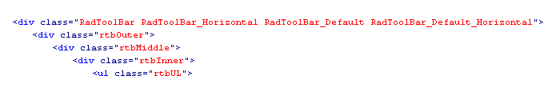
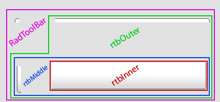
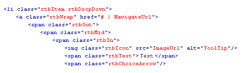
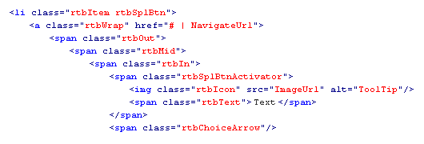
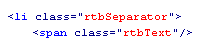

# HTML Structure

## Overview

RadToolBar for ASP.NET AJAX introduces a completely different rendering than its predecessor. The drawback of gaining the semantic markup and much more flexible styling opportunities is the lack of ability to migrate a skin from earlier vesions - this guide is aimed to make this process easier by explaining the main points that should be taken into consideration when styling the RadToolBar.

## Anatomy

## The containers

The ul element that holds the RadToolBar is surrounded by four containers - inner, middle, outer, and the control container. This way, the ToolBar can handle skins with rounded corners and items with variable height gracefully. The image below shows how this effect is achieved using CSS backgrounds on the corresponding elements.

## The items

All RadToolBar items follow a similar container convention for their wrappers, for the same reason - applying rounded corners, regardless of the button size. When the ImageUrl property isn't set, the rtbIcon element is not shown. Below is shown the HTML structure of each RadToolBar item:

## Button

## Drop-down button

## Split button

## Separators

## Styling notes

The rtbChoiceArrow element holds the arrow for the drop-down and split buttons. Its width/height and background-image should be set accordingly in order to make these buttons identifiable.
