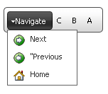

# RTL support


## 

**RadToolBar** includes support for right-to-left locales using the direction attribute. If you set **dir="rtl"** on the **RadToolBar** object (or to any parent HTML element), **RadToolBar** reverses button order and moves the drop-down arrow on **RadToolBarDropDown** and **RadToolBarSplitButton** to the left side:


>caption 



````ASPNET
	    <telerik:RadToolBar ID="RadToolBar1" runat="server" dir="rtl">
	        <Items>
	            <telerik:RadToolBarButton runat="server" Text="A" />
	            <telerik:RadToolBarButton runat="server" Text="B" />
	            <telerik:RadToolBarButton runat="server" Text="C" />
	            <telerik:RadToolBarDropDown runat="server" Text="Navigate">
	                <Buttons>
	                    <telerik:RadToolBarButton runat="server" Text="Next" ImageUrl="~/Images/Next.gif" />
	                    <telerik:RadToolBarButton runat="server" Text="Previous" ImageUrl="~/Images/Back.gif" />
	                    <telerik:RadToolBarButton runat="server" Text="Home" ImageUrl="~/Images/Home.gif" />
	                </Buttons>
	            </telerik:RadToolBarDropDown>
	        </Items>
	    </telerik:RadToolBar>
````


>note Note that images in drop-down lists still appear on the left.
>


# See Also

 * [Controlling Appearance]()
