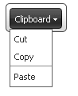

# Separators


## 

You can use the __RadToolBarButton__ objects that appear in drop-down lists as separators. By using separators, you can divide the items in a drop-down list into two or more groups, making them easier for a user to interpret.

To set a given button as a separator, set its __IsSeparator__ property to __True__. When __IsSeparator__ is __True__, the separator is rendered as a horizontal line. Its __Text__ and __ImageUrl__ properties are ignored.

>note If you set the __IsSeparator__ property to __True__ on a button that is in the toolbar rather than a drop-down list, it has no effect on the appearance of the toolbar. The toolbar appears as if the button did not exist in its __Items__ collection.
>


The example below shows a drop-down list with a separator:



````ASPNET
	    <telerik:RadToolBar ID="RadToolBar1" runat="server">
	        <Items>
	            <telerik:RadToolBarDropDown runat="server" Text="Clipboard">
	                <Buttons>
	                    <telerik:RadToolBarButton runat="server" Text="Cut" />
	                    <telerik:RadToolBarButton runat="server" Text="Copy" />
	                    <telerik:RadToolBarButton runat="server" IsSeparator="True" Text="This does not appear" />
	                    <telerik:RadToolBarButton runat="server" Text="Paste" />
	                </Buttons>
	            </telerik:RadToolBarDropDown>
	        </Items>
	    </telerik:RadToolBar>
````


# See Also

 * [Controlling Appearance]()
