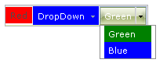

# Setting  the CSS Class of Buttons

**RadToolBarItem** objects have a number of properties whose value is the name of a CSS class. These properties let you alter the appearance of individual buttons in the toolbar without using a [custom skin]().

The CSS class properties are

* **CssClass**: controls the appearance of the button in all states.

* **OuterCssClass**: controls the appearance of the button's outmost (&lt;LI&gt;) element. Added in Q1 2010 release

* **FocusedCssClass**: controls the appearance of the button when it has focus.

* **DisabledCssClass**: controls the appearance of the button when it is disabled.

* **HoveredCssClass**: controls the appearance of the button when the mouse is over it.

* **ClickedCssClass**: controls the appearance of the button when it is clicked.

* **CheckedCssClass** (**RadToolBarButton** only): controls the appearance of the button when it is in the checked state.

To set the CSS class properties of an item at design time, use the [RadToolBar Item Builder]().

>note The CSS class of a button is applied to the anchor (&lt;a&gt;) tag that represents the button in the rendered HTML output. For more information about the rendered output of **RadToolBar** , see [Understanding the Skin CSS File]().
>


## Defining the CSS Class

There are two ways you can define the CSS classes that you add using the CSS class properties:

* You can use a separate CSS file. When taking this approach, you must add a <link> tag to the <head> section of the ASPX file:

````ASPNET
<head runat="server">
    <title>Untitled Page</title>
    <link href="App_Data/MyStyles.css" rel="stylesheet" type="text/css" />
</head>
````

* You can define the styles directly in the <head> section of the ASPX file:

````ASPNET
<head runat="server">
    <title>Untitled Page</title>
    <style>
        .MyButton
        {
            background: url(Images/MyButtonImage.gif) no-repeat 0 100%;
            padding-left: 5px;
        }
    </style>
</head>
````

## Example

The following example shows how to use the CssClass property to change the appearance of toolbar buttons. Note that the Split button uses the CssClass of the default button in its drop-down list:


>caption 



````ASPNET
<head runat="server">
    <title>Untitled Page</title>
    <style>
        .RedButton
        {
            background: red;
        }
        .GreenButton
        {
            background: green;
            color: white !important;
        }
        .BlueButton
        {
            background: blue;
            color: white !important;
        }
    </style>
</head>
<body>
    <form id="form1" runat="server">
    <asp:ScriptManager ID="ScriptManager1" runat="server" />
    <div>
        <telerik:RadToolBar RenderMode="Lightweight" ID="RadToolBar1" runat="server" Skin="Telerik">
            <Items>
                <telerik:RadToolBarButton runat="server" CssClass="RedButton" Text="Red" />
                <telerik:RadToolBarDropDown runat="server" CssClass="BlueButton" Text="DropDown">
                    <Buttons>
                        <telerik:RadToolBarButton runat="server" CssClass="GreenButton" Text="Green" />
                        <telerik:RadToolBarButton runat="server" CssClass="BlueButton" Text="Blue" />
                    </Buttons>
                </telerik:RadToolBarDropDown>
                <telerik:RadToolBarSplitButton runat="server" CssClass="RedButton">
                    <Buttons>
                        <telerik:RadToolBarButton runat="server" CssClass="GreenButton" Text="Green" />
                        <telerik:RadToolBarButton runat="server" CssClass="BlueButton" Text="Blue" />
                    </Buttons>
                </telerik:RadToolBarSplitButton>
            </Items>
        </telerik:RadToolBar>
    </div>
    </form>
</body>
````

>note Note the use of the **!important** modifier in the CSS class definitions. This allows the CSS class to affect the appearance of items in spite of a competing definition in the Skin CSS file.
>


# See Also

 * [Controlling Appearance]()

 * [Adding Images to Buttons]()

 * [Overview]()
