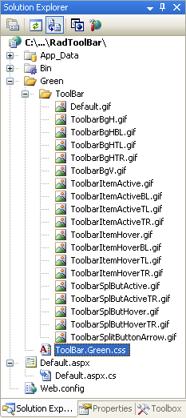

# Tutorial Creating A Custom Skin

The following tutorial demonstrates creating a custom **RadToolBar** skin, using the default skin as a base. This new skin will take the appearance of the toolbar from its default look:


to the following:


>tip See [Understanding the Skin CSS File]() for more information on specific CSS file properties.
>


## Prepare the Project

1. Drag a **RadToolBar** from the toolbox onto a new AJAX-enabled application Web form.

1. Use the **RadToolBar Item Builder** to add items to the toolbar, or add them in the HTML markup:

````ASPNET
<telerik:RadToolBar RenderMode="Lightweight" ID="RadToolBar1" runat="server">
    <Items>
        <telerik:RadToolBarButton runat="server" Checked="True" CheckOnClick="True" Group="Group1"
            Text="A">
        </telerik:RadToolBarButton>
        <telerik:RadToolBarButton runat="server" CheckOnClick="True" Group="Group1" Text="B">
        </telerik:RadToolBarButton>
        <telerik:RadToolBarButton runat="server" CheckOnClick="True" Group="Group1" Text="C">
        </telerik:RadToolBarButton>
        <telerik:RadToolBarButton runat="server" Enabled="False" Text="Disabled">
        </telerik:RadToolBarButton>
        <telerik:RadToolBarDropDown runat="server" Text="DropDown">
            <Buttons>
                <telerik:RadToolBarButton runat="server" Text="One" />
                <telerik:RadToolBarButton runat="server" Text="Two" />
            </Buttons>
        </telerik:RadToolBarDropDown>
        <telerik:RadToolBarSplitButton runat="server" DefaultButtonIndex="0">
            <Buttons>
                <telerik:RadToolBarButton runat="server" Text="First" />
                <telerik:RadToolBarButton runat="server" Text="Second" />
            </Buttons>
        </telerik:RadToolBarSplitButton>
    </Items>
</telerik:RadToolBar>
````


1. In the Solution Explorer, create a new "Green" directory in your project.

1. Copy the default **RadToolBar** skin files from the installation directory to the "Green" directory; copy both the \ToolBar directory that contains the images for this skin and the ToolBar.Default.css file that defines the skin styles.

>tip The file path will typically be similar to this example: *\Program Files\Progress\UI for ASP.NET AJAX RX YYYY\Skins\Default.* 
>


1. In the Solution Explorer, rename "ToolBar.Default.css" to "ToolBar.Green.css". The Solution Explorer should now look something like the following:

1. Open ToolBar.Green.css and replace all instances of _Default with _Green. Then save the file:

1. Drag the "ToolBar.Green.Css" file from the Solution Explorer onto your Web page. This automatically adds a reference to the page "<head>" tag as a "<link>" to the new stylesheet:

````ASPNET
<head runat="server">
    <title>Untitled Page</title>
    <link href="Green/ToolBar.Green.css" rel="stylesheet" type="text/css" />
</head>
````

1. Set the **EnableEmbeddedSkins** property of your **RadToolBar** control to **False**.

1. Change the **Skin** property of your **RadToolBar** control to "Green".

1. Run the application. The new "Green" skin looks just like the Default skin:

## CSS classes for toolbar buttons

1. The rounded edges of the toolbar are handled by a series of nested DIV elements in the rendered HTML for the toolbar. These DIV elements have the following classes applied (in order): **.RadToolBar_Green_Horizontal**, **.rtbOuter**,**.rtbMiddle**, and **.rtbInner**. Locate the selectors that assign the background graphics for these outer DIV elements.They should look like the following:

````XML
.RadToolBar_Green_Horizontal
{ 
    background: transparent url('ToolBar/ToolbarBgHTL.gif') no-repeat;
}

.RadToolBar_Green_Horizontal .rtbOuter
{ 
    background: transparent url('ToolBar/ToolbarBgHTR.gif') no-repeat;
}
 
.RadToolBar_Green_Horizontal .rtbMiddle
{ 
    background: transparent url('ToolBar/ToolbarBgHBL.gif') no-repeat;
} 

.RadToolBar_Green_Horizontal .rtbInner
{ 
    background: transparent url('ToolBar/ToolbarBgH.gif') no-repeat;
}
````

1. Rather than create a new set of graphics to nest together for a green toolbar, this tutorial will use a simple green background. Therefore, delete all but the first rules shown above, and for the first rule, replace the background image with a simple color:

````XML
.RadToolBar_Green_Horizontal
{ 
    background: #90cc90;
}
````


1. Another set of selectors set the padding and margins so that the background images you deleted line up properly to create rounded corners. These (shown below) can be deleted as well:

````XML
div.RadToolBar_Green
{ 
    background-position: 0 0; 
    padding: 0 0 0 5px; /* rounded corner radius */ 
    margin: 0;
} 

.RadToolBar_Green .rtbOuter
{ 
    background-position: 100% 0; 
    padding-top: 5px; /* rounded corner radius */
} 

.RadToolBar_Green .rtbMiddle
{ 
    background-position: 0 100%; 
    padding-left: 5px; /* rounded corner radius */ 
    margin-left: -5px; /* - rounded corner radius */
} 

.RadToolBar_Green .rtbInner
{ 
    background-position: 100% 100%; 
    padding: 0 5px 5px 0; /* rounded corner radius */ 
    margin: 0;
}
````


1. The toolbar is rendered using an unordered list &lt;UL&gt;. Each button in the toolbar is a list item (&lt;LI&gt;) with the **.rtbItem** class applied, along with additional classes that reflect the button's state. Inside the <LI> element, the button is represented by an anchor element (&lt;A&gt;) with the **.rtbWrap** class applied. Locate the selectors for buttons when the mouse hovers over them. These are **.rtbItemHovered .rtbWrap** and (using the :hover pseudo-class) **.rtbItem .rtbWrap:hover**. Instead of the background image, provide the following rule:

````XML
 .RadToolBar_Green .rtbItemHovered .rtbWrap,
 .RadToolBar_Green .rtbItem .rtbWrap:hover { background: #beb; }
````


1. Locate the selectors for buttons that are checked, expanded, or have focus. These have the **.rtbItemFocused**, **.rtbChecked**, **.rtbDropDownExpanded**, or .**rtbSplBtnExpanded** classes applied. Instead of the background image, provide the following rule:

````XML
.RadToolBar_Green .rtbItemFocused .rtbWrap, 
.RadToolBar_Green .rtbChecked .rtbWrap,
.RadToolBar_Green .rtbUL .rtbDropDownExpanded .rtbWrap, 
.RadToolBar_Green .rtbUL .rtbSplBtnExpanded .rtbWrap { background: #595; }
````

1. Locate the **.RadToolBarGreen .rtbWrap** selector. This rule is applied to all tools in the toolbar. Add a green border:

````XML
.RadToolBar_Green .rtbWrap
{ 
    font: 11px Tahoma, sans-serif; 
    color: #000; 
    border: solid 1px green;
}
````

1. Inside the &lt;A&gt; element for each button, three nested &lt;SPAN&gt; elements are used to create rounded corners on buttons, similar to the way the three nested &lt;DIV&gt; elements are used to create rounded corners on the toolbar.They have the **.rtbOut**, **.rtbMid**, and **.rtbIn** classes applied. Delete the selectors that assign background graphics to create these rounded corners (but keep the selectors that assign padding):

````XML
.RadToolBar_Green .rtbItemHovered .rtbOut,
.RadToolBar_Green .rtbWrap:hover .rtbOut
{ 
    background: transparent url('ToolBar/ToolbarItemHoverTR.gif') no-repeat 100% 0;
} 
.RadToolBar_Green .rtbItemFocused .rtbOut,
.RadToolBar_Green .rtbChecked .rtbOut,
.RadToolBar_Green .rtbUL .rtbDropDownExpanded .rtbOut,
.RadToolBar_Green .rtbUL .rtbSplBtnExpanded .rtbOut 
{ 
    background: transparent url('ToolBar/ToolbarItemActiveTR.gif') no-repeat 100% 0; 
} 
.RadToolBar_Green .rtbItemHovered .rtbMid,
.RadToolBar_Green .rtbWrap:hover.rtbMid 
{ 
    background: transparent url('ToolBar/ToolbarItemHoverTL.gif') no-repeat 0 0; 
} 
.RadToolBar_Green .rtbItemFocused .rtbMid,
.RadToolBar_Green .rtbChecked .rtbMid,
.RadToolBar_Green.rtbUL .rtbDropDownExpanded .rtbMid,
.RadToolBar_Green .rtbUL .rtbSplBtnExpanded.rtbMid 
{ 
    background: transparent url('ToolBar/ToolbarItemActiveTL.gif') no-repeat 0 0; 
 } 
.RadToolBar_Green .rtbItemHovered .rtbIn,
.RadToolBar_Green .rtbWrap:hover .rtbIn
{ 
    background: transparent url('ToolBar/ToolbarItemHover.gif') no-repeat 100% 100%; 
} 
.RadToolBar_Green .rtbItemFocused .rtbIn,
.RadToolBar_Green .rtbChecked .rtbIn,
.RadToolBar_Green .rtbUL .rtbDropDownExpanded .rtbIn,
.RadToolBar_Green .rtbUL .rtbSplBtnExpanded .rtbIn
{
    background: transparent url('ToolBar/ToolbarItemActive.gif') no-repeat 100% 100%;
}
````


1. The analogous rules for split buttons appear further down in the CSS file. Delete them as well:

````XML
.RadToolBar_Green .rtbSplButHovered .rtbOut,
.RadToolBar_Green .rtbSplBtn .rtbWrap:hover.rtbOut 
{ 
    background: transparent url('ToolBar/ToolbarSplButHoverTR.gif') no-repeat 100% 0; 
} 

.RadToolBar_Green .rtbSplButHovered .rtbIn,
.RadToolBar_Green .rtbSplBtn
.rtbWrap:hover .rtbIn
{ 
    background: transparent url('ToolBar/ToolbarSplButHover.gif') no-repeat 100% 100%; 
} 

.RadToolBar_Green .rtbUL .rtbSplBtnExpanded .rtbWrap .rtbOut
{ 
    background: transparent url('ToolBar/ToolbarSplButActiveTR.gif') no-repeat 100% 0; 
} 

.RadToolBar_Green .rtbUL .rtbSplBtnExpanded .rtbWrap .rtbIn
{ 
    background: transparent url('ToolBar/ToolbarSplButActive.gif') no-repeat 100% 100%; 
}
````


1. The text labels for buttons is rendered as a SPAN element with the **.rtbText** class applied. Locate the selectors that set the font color when the mouse hovers over the button, and change the font color to green:

````XML
.RadToolBar_Green .rtbWrap:hover .rtbText,
.RadToolBar_Green .rtbChecked:hover .rtbText
{
    color: green;
}
````


## CSS classes for drop-down lists

1. Drop-down lists are rendered as DIV elements with the **RadToolBarDropDown_Green** class applied. Inside the DIV, the layout of the drop-down list is handled by a UL element with the **.rtbGroup** class applied. Each item in the list has the **.rtbItem** class applied. locate the .RadToolBarDropDown_Green .rtbGroup and .RadToolBarDropDown_Green .rtbGroup .rtbItem selectors, and change the background color to a pale green:

````XML
.RadToolBarDropDown_Green .rtbGroup 
{ 
    background: #dfd;
} 
.RadToolBarDropDown_Green .rtbGroup .rtbItem 
{ 
    text-decoration: none; 
    background: #dfd;
}
````

1. When items in the drop-down list have focus, they get the **.rtbFocused** class applied. When the mouse hovers over them, they get the **.rtbItemHovered** class applied. Locate the selector that changes the background color for focused items and change it from "#444" to "#595":

````XML
.RadToolBarDropDown_Green .rtbGroup .rtbItemHovered,
.RadToolBarDropDown_Green .rtbGroup .rtbFocused,
.RadToolBarDropDown_Green .rtbGroup .rtbExpanded 
{ 
    background: #595;
}
````

1. Locate the rule with the **.RadToolBarDropDown_Green .rtbGroup** selector that assigns the border of the drop down lists. Change the border color to green and the background to "#595":

````XML
.RadToolBarDropDown_Green .rtbGroup 
{ 
    border: 1px solid green; 
    background-color: #595;
}
````

1. Disabled items in the drop-down list have the **.rtbDisabled** class applied. Locate the selector for disabled items and change the background color to "#dfd":

````XML
.RadToolBarDropDown_Green .rtbGroup .rtbItem .rtbDisabled 
{ 
    background-color: #dfd;
}
````

1. Separators are rendered with the **.rtbSeparator** class applied. Locate the rule for the separator item and change the background color to "#dfd":

````XML
.RadToolBarDropDown_Green .rtbSeparator 
{ 
    background: #dfd; 
    padding-top: 1px; 
    margin: 1px 0;
}
````

1. Run the application to see the effect of these changes:
>caption 


For more information about Cascading Style Sheets, see

* [World Wide Web Consortium CSS specifications](http://www.w3.org/Style/CSS/)

* [W3 Schools CSS tutorial](http://www.w3schools.com/css/default.asp)

* [Guide to Cascading Style Sheets](http://www.htmlhelp.com/reference/css/)

# See Also

 * [Skins]()

 * [Setting  the CSS Class of Buttons]()
