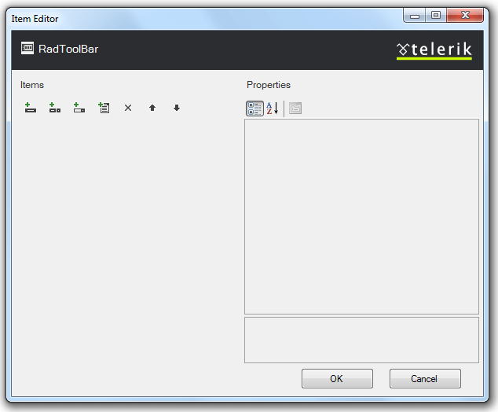
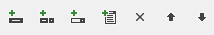
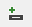
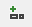
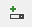
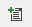
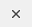
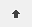
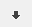

# RadToolBar Item Editor

The **RadToolBar Item Editor** lets you populate your toolbar with buttons. There are two ways to bring up the RadToolBar Item Editor:

* From the **RadToolBar**[ Smart Tag ](5BB964CF-AA36-443D-824B-60964E411B25), click on the **Build RadToolBar** link.

* Right-click on the **RadToolBar** component and select **Build RadToolBar** from its context menu.

## RadToolBar Item Editor

The **RadToolBar Item Editor** lets you add, rearrange, configure, and delete buttons on the toolbar. These actions are initiated using the toolbar at the upper left of the Item Editor:

The following table describes the controls in the toolbar:

| Button | Function |
| ------ | ------ |
||Adds a **RadToolBarButton** to the toolbar in the next available position.|
||Adds a **RadToolBarDropDown** to the toolbar in the next available position.|
||Adds a **RadToolBarSplitButton** to the toolbar in the next available position.|
||Adds a **RadToolBarButton** to the end of the drop-down list for the currently selected **RadToolBarDropDown** or **RadToolBarSplitButton** .|
||Deletes the currently selected button from the toolbar or drop-down list.|
||Moves the currently selected button backward in the toolbar or drop-down list so that it precedes the previous sibling.|
||Moves the currently selected tab forward in the toolbar or drop-down list, so that it follows the next sibling.|

## 

When a button is selected, the properties pane on the right of the **RadToolBar Item Editor** lets you configure the item by setting its properties. For each button,

* **Text** is the text that appears on the button.

* **ToolTip** is the text of a tooltip that appears when the user hovers the mouse over the button.

* **Enabled** controls whether the button is initially enabled or disabled.

* **CssClass**, **OuterCssClass**, **FocusedCssClass**, **DisabledCssClass**, **HoveredCssClass**, and **ClickedCssClass**[control the appearance of the button]() when it is in its normal state, has focus, is disabled, is under the mouse, and is clicked, respectively.(**RadToolBarButton** has an additional property, **CheckedCssClass**, for when it is checked).

* **ImageUrl**, **FocusedImageUrl**, **DisabledImageUrl**, **HoveredImageUrl**, and **ClickedImageUrl** let you [add an image]() that appears next to the button text when it is in its normal state, focused, disabled, under the mouse, or clicked, respectively. (**RadToolBarButton** has an additional property, **CheckedImageUrl**, for supplying an image when the button is checked.)

* **ImagePosition** lets you specify where the image appears relative to the text of the button.

In addition to these properties, which are common to all types of buttons, **RadToolBarButton** and **RadToolBarSplitButton** support some additional properties:

* **Value** is a string value that you can associate with the button for use when programming the button behavior.

* **CommandName** and **CommandArgument** let you associate a command with the button.

* **NavigateUrl** and **Target** cause the tab to automatically launch another Web page (specified by **NavigateUrl**) in the window specified by **Target**. If the **Target** property is not set, the new Web page uses the current browser window.

* **PostBack** and **PostBackUrl** specify whether the button causes a postback when clicked, and the URL of the page that is the target of that postback.

* **EnableDefaultButton** and **DefaultButtonIndex** let you assign one of the buttons in its drop-down list as the [default button]() of a **RadToolBarSplitButton**.

* **IsSeparator**lets you convert a **RadToolBarButton** into a [separator]().

* **CheckOnClick** lets you allow **RadToolBarButton** to support a [checked state](). When **RadToolBarButton** supports a checked state, **Checked** specifies the initial checked state, and **AllowSelfUnCheck** specifies whether users can uncheck the button by clicking. **Group**lets you associate the **RadToolBarButton** controls with a group, so that they function like a radio group.

# See Also

 * [Overview]()
