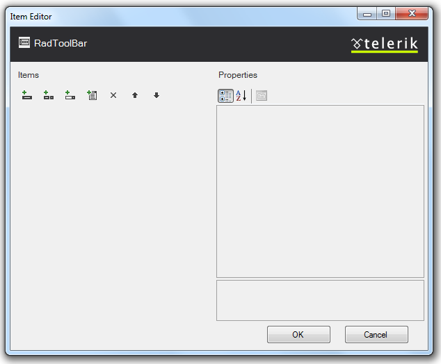

# RadToolBar Item Editor

The __RadToolBar Item Editor__ lets you populate your toolbar with buttons. There are two ways to bring up the RadToolBar Item Editor:

* From the __RadToolBar__[ Smart Tag ](5BB964CF-AA36-443D-824B-60964E411B25), click on the __Build RadToolBar__ link.

* Right-click on the __RadToolBar__ component and select __Build RadToolBar__ from its context menu.

## RadToolBar Item Editor

The __RadToolBar Item Editor__ lets you add, rearrange, configure, and delete buttons on the toolbar. These actions are initiated using the toolbar at the upper left of the Item Editor:

The following table describes the controls in the toolbar:

| Button | Function |
| ------ | ------ |
||Adds a __RadToolBarButton__ to the toolbar in the next available position.|
||Adds a __RadToolBarDropDown__ to the toolbar in the next available position.|
||Adds a __RadToolBarSplitButton__ to the toolbar in the next available position.|
||Adds a __RadToolBarButton__ to the end of the drop-down list for the currently selected __RadToolBarDropDown__ or __RadToolBarSplitButton__ .|
||Deletes the currently selected button from the toolbar or drop-down list.|
||Moves the currently selected button backward in the toolbar or drop-down list so that it precedes the previous sibling.|
||Moves the currently selected tab forward in the toolbar or drop-down list, so that it follows the next sibling.|

## 

When a button is selected, the properties pane on the right of the __RadToolBar Item Editor__ lets you configure the item by setting its properties. For each button,

* __Text__ is the text that appears on the button.

* __ToolTip__ is the text of a tooltip that appears when the user hovers the mouse over the button.

* __Enabled__ controls whether the button is initially enabled or disabled.

* __CssClass__, __OuterCssClass__, __FocusedCssClass__, __DisabledCssClass__, __HoveredCssClass__, and __ClickedCssClass__[control the appearance of the button]() when it is in its normal state, has focus, is disabled, is under the mouse, and is clicked, respectively.(__RadToolBarButton__ has an additional property, __CheckedCssClass__, for when it is checked).

* __ImageUrl__, __FocusedImageUrl__, __DisabledImageUrl__, __HoveredImageUrl__, and __ClickedImageUrl__ let you [add an image]() that appears next to the button text when it is in its normal state, focused, disabled, under the mouse, or clicked, respectively. (__RadToolBarButton__ has an additional property, __CheckedImageUrl__, for supplying an image when the button is checked.)

* __ImagePosition__ lets you specify where the image appears relative to the text of the button.

In addition to these properties, which are common to all types of buttons, __RadToolBarButton__ and __RadToolBarSplitButton__ support some additional properties:

* __Value__ is a string value that you can associate with the button for use when programming the button behavior.

* __CommandName__ and __CommandArgument__ let you associate a command with the button.

* __NavigateUrl__ and __Target__ cause the tab to automatically launch another Web page (specified by __NavigateUrl__) in the window specified by __Target__. If the __Target__ property is not set, the new Web page uses the current browser window.

* __PostBack__ and __PostBackUrl__ specify whether the button causes a postback when clicked, and the URL of the page that is the target of that postback.

* __EnableDefaultButton__ and __DefaultButtonIndex__ let you assign one of the buttons in its drop-down list as the [default button]() of a __RadToolBarSplitButton__.

* __IsSeparator__lets you convert a __RadToolBarButton__ into a [separator]().

* __CheckOnClick__ lets you allow __RadToolBarButton__ to support a [checked state](). When __RadToolBarButton__ supports a checked state, __Checked__ specifies the initial checked state, and __AllowSelfUnCheck__ specifies whether users can uncheck the button by clicking. __Group__lets you associate the __RadToolBarButton__ controls with a group, so that they function like a radio group.

# See Also

 * [Overview]()
