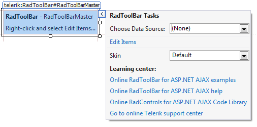
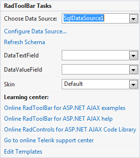

# Smart Tag

The **RadToolBar** Smart Tag allows easy access to frequently needed tasks. You can display the Smart Tag by right clicking on a **RadToolBar** control in the design window, and choosing **Show Smart Tag**.

## Unbound Smart Tag

When **RadToolBar** is unbound, the Smart Tag looks like the following:

Using the unbound **RadToolBar** Smart Tag you can perform the following:

## RadToolBar Tasks

* **Choose Data Source** lets you bind the menu declaratively by selecting a data source from a drop-down list of all available data source components. If you select **<New Data Source...>** the standard Windows [Data Source Configuration Wizard](https://msdn2.microsoft.com/en-us/library/ms247282(VS.80).aspx) appears, where you can create and configure a data source component.

* **Build RadToolBar...** opens the [RadToolBar Item Editor](), where you can create and configure statically-defined buttons for your toolbar.

## Ajax Resources

* **Add RadAjaxManager...** adds a RadAjaxManager component to your Web page, and displays the **r.a.d.ajax Property Builder** where you can configure it.

* **Replace ScriptManager with RadScriptManager** replaces the default **ScriptManager** component that is added for AJAX-enabled Web sites with **RadScriptManager**.

* Add **RadStyleSheetManager** adds a **RadStyleSheetManager** to your Web page.

## Skin

The **Skin** drop-down lets you preview the built-in [skins]() and select one for your menu.

## Learning Center

Links navigate you directly to RadToolBar examples, help, or code library. You can also search the Telerik web site for a given string.

## Edit Templates

Clicking the **Edit Templates** link brings up a [template design surface]() where you can create or edit the [templates]() your **RadToolBar** uses.

## Bound Smart Tag

When **RadToolBar** is bound to a data source, the Smart Tag looks like the following:

Using the bound **RadToolBar** Smart Tag you can perform any task you can perform with the unbound Smart Tag. In addition, you can choose **Configure Data Source...** to open the standard Windows [Data Source Configuration Wizard](https://msdn2.microsoft.com/en-us/library/ms247282(VS.80).aspx), where you can configure the currently bound data source component.

Once the Data Source is chosen, you can select each of the following - **DataTextField** and **DataValueField**. These should be fields in the Data Source which will serve data respectively for the **Text** and **Value** properties of RadToolBar Buttons.
