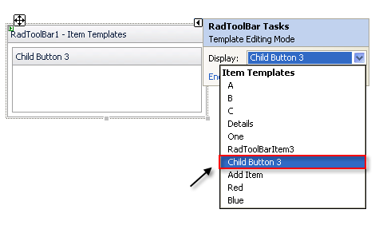

# Template Design Surface

## 

The **Template Design Surface** lets you design templates for the buttons that appear in the toolbar. There are two ways to display the Template Design Surface:

* Choose **Edit Templates** from the **RadToolBar** [Smart Tag]().

* Choose **Edit Template** from the **RadToolBar** context menu and select the type of template you want to edit.

Either way, the Template Design Surface appears:

On the design surface, you can drag any controls from the toolbox, as well as typing any literal text.

You can edit templates for individual buttons. Once you have added buttons to your **RadToolBar** component, select a specific button from the list of item templates in the Smart Tag, or edit them all at once by choosing **Edit Template | Item Templates** from the **RadToolBar** context menu.

When you have finished designing your template, choose **End Template Editing** from the **RadToolBar** context menu or Smart Tag.

# See Also

 * [Overview]()
