# Binding to a Data Source

## 

This tutorial shows how to bind **RadToolBar** to an **AccessDataSource**:

1. Locate the file "Chart.mdb" file that appears in the **Live Demos/App_Data** folder of your **RadControls** installation. Drag this file to the **App_Data** folder in the Solution Explorer for your project:
>caption 

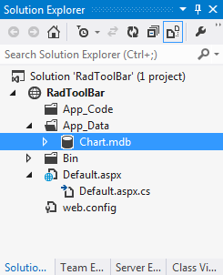

1. Drag a **RadToolBar** component from the toolbox onto your Web page. The **RadToolBar** [Smart Tag]() should appear automatically:
>caption 

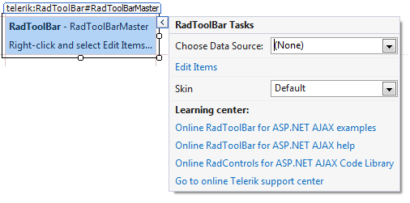

1. In the **RadToolBar** Smart Tag, use the **Skin** drop-down to change the [skin]() for the **RadToolBar** to "Hay":
>caption 

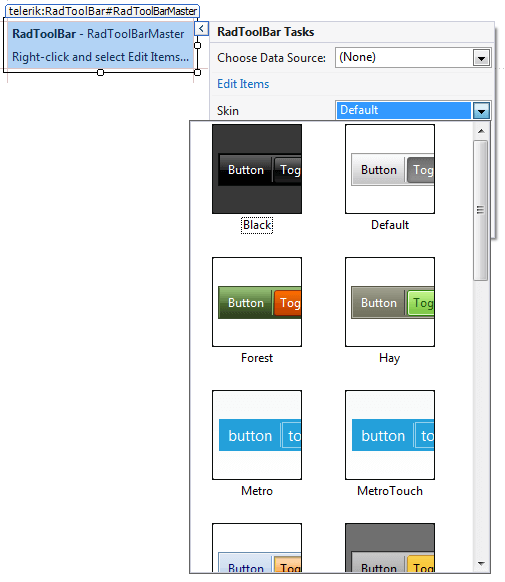

1. Still in the Smart Tag, open the **Choose Data Source** drop-down and select **New Data Source**.
>caption 

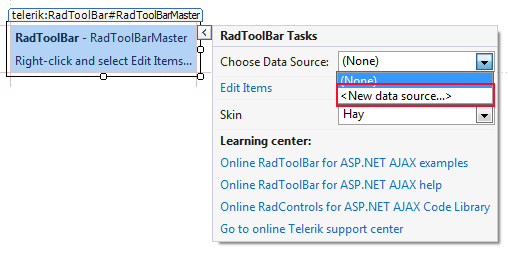

1. The Data Source Configuration Wizard appears. In the Select a DataSource Type screen, specify an **AccessDataSource** and click **OK.**
>caption 

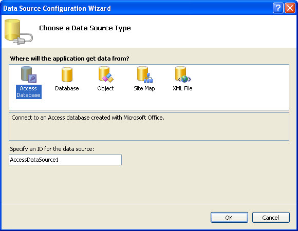

1. In the **Choose a Database** screen, click the **Browse** button, and select the "Chart.mdb" file. Then choose **Next** to continue:
>caption 

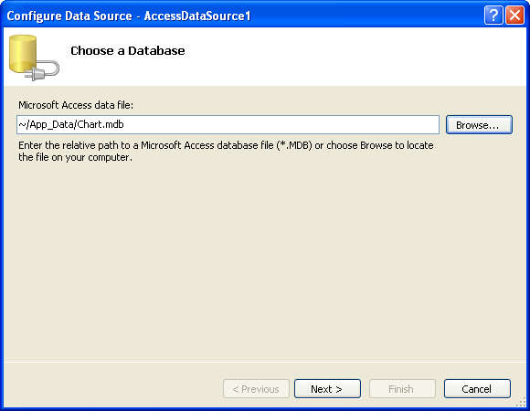

1. In the **Configure the Select Statement** screen, choose **Specify columns from a table or view**. Select the "Subcategory" table from the **Name** drop down, and select the "Id", "Name", and "Category_id" fields:
>caption 

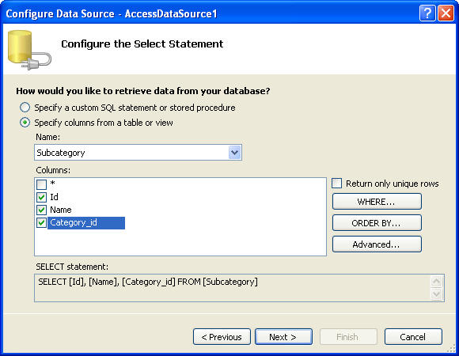

1. Click the **WHERE** button to add a where clause to your query. In the Add WHERE Clause screen, set the **Column** to "Category_Id", the **Operator** to "=", the **Source** to "None", and set the parameter value to "1":
>caption 

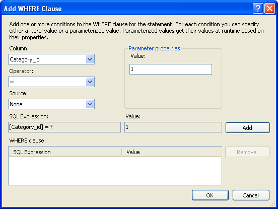

1. Click the **Add** button to add the WHERE clause, and then click OK.

1. Back in the Configure The Select Statement page, click Next to accept the select statement.

1. Click the Test Query button to see the data from the data source. Then choose Finish to exit the Wizard:
>caption 

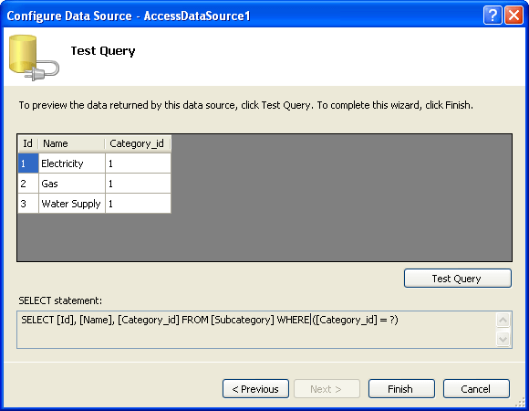

1. In the Properties pane for the **RadToolBar** component:

1. Set the **DataTextField** property to "Name".

1. Set the **DataValueField** property to "Id".
>caption 

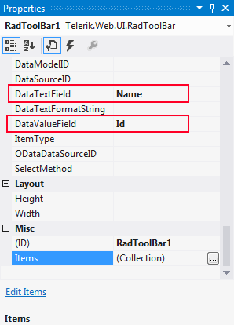

1. Run the application. Note that the tabs are labelled using the "Name" field of the data source:
>caption 

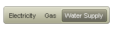

# See Also

 * [Overview]()

 * [Overview]()
