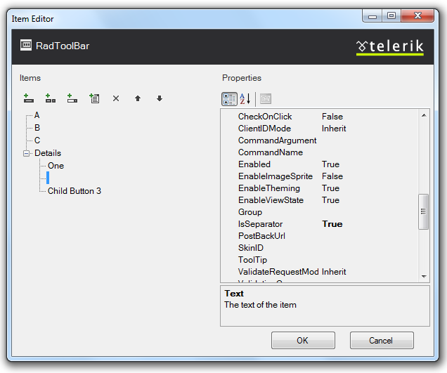
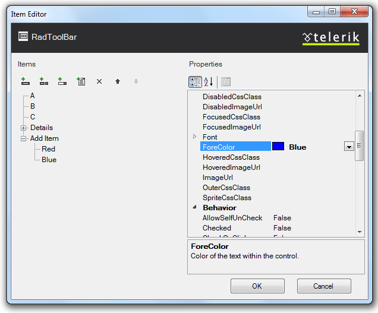
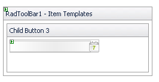
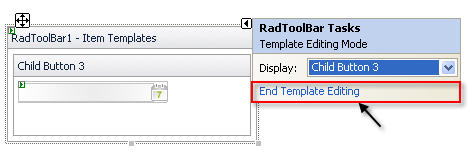
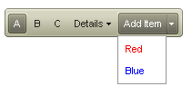

# Getting Started Overview

## 

This tutorial will walk you through creating a __RadToolBar__ and shows how to:

* Use the __RadToolBar Item Editor__ to build a simple toolbar.

* Use different types of toolbar buttons.

* Apply a skin to the toolbar to change its look & feel.

1. Drag a __RadToolBar__ component from the toolbox onto your Web page. The __RadToolBar__[ Smart Tag ](5BB964CF-AA36-443D-824B-60964E411B25) should appear automatically:
>caption 

1. On the Smart Tag, choose __Edit Items.__ The [RadToolBar Item Editor]() appears:
>caption 

1. Click the __Add RadToolBarButton__ button (
>caption 

 to add a button to your toolbar.

1. In the properties pane on the right of the item editor, set the following properties for the button you added:

* Set the __Text__ property to "A".

* Set the __CheckOnClick__ property to __True__. This makes the button have two states, "on" (checked) and "off" (unchecked).

* Set the __Checked__ property to __True__. This sets this button's state to "on".

* Set the __Group__ property to "Group1". This makes the button part of a group that act like radio buttons.

1. Click the __Add RadToolBarButton__ button two more times to add two more buttons to the toolbar. Set their properties as follows:

* Set the __Text__ property to ""B" and "C", respectively.

* Set the __CheckOnClick__ property to True.

* Set the __Group__ property to "Group1".The item editor should now look like the following:
>caption 

1. Click the __Add RadToolBarDropDown__ button ( 
>caption 

) to add a drop-down button to the toolbar. With the drop-down button selected, use the properties pane to change its __Text__ property to "Details".

1. With the "Details" button selected, click the __Add RadToolBarButton to drop-down__ button ( 
>caption 

) to add a button to the drop-down list of the "Details" button. Select the button you added to the list and set its __Text__ property to "One".

1. Select the "Details" button again and click the __Add RadToolBarButton to drop-down__ button two more times to add two more buttons to the drop-down list.

* On the first of these (the second button in the drop-down list), set the __IsSeparator__ property to __True__ and the __Text__ property to an empty string.The item builder should now look like the following:
>caption 

1. Click the __Add RadToolBarSplitButton__ button ( 
>caption 

 ) to add a split button to the toolbar.

* Set its __Text__ property to "Add Item".

* Set its __EnableDefaultButton__ property to __False__.

1. With the "Add Item" button selected, click the __Add RadToolBarButton to drop-down__ button two times to add two child buttons to the drop-down list of the split button.

* On the first, set the __Text__ property to "Red" and the __ForeColor__ property to "Red".

* On the second, set the __Text__ property to "Blue" and the __ForeColor__ property to "Blue".The item builder should look like the following:
>caption 

1. Click Ok to exit.

1. In the __RadToolBar__ Smart Tag, use the __Skin__ drop-down to change the [skin]() for the __RadToolBar__ to "Hay":
>caption 

1. Still in the Smart Tag, click the __Edit Templates__ link to apply a template to one of the toolbar buttons:
>caption 

1. The Smart Tag changes to template editing mode.From the Display drop-down, select "Child Button 3" to attach a template to "Child Button 3":
>caption 

1. Drag a __RadDatePicker__ from the toolbox onto the Template Design Surface and set its __Skin__ property to "Inox":
>caption 

1. Choose __End Template Editing__ from the __RadToolBar__ Smart Tag:
>caption 

1. Run the application. Click on the first three buttons on the toolbar ("A", "B", and "C") and note how they function as a radio group. Click on the "Details" button to expand its drop-down list. Note the separator you added, and the date picker, which you can click to select a date:
>caption 

1. Click the "Add Item" button, and note that its appearance changes to respond to the click, but the drop-down does not appear unless you click the drop-down arrow:
>caption 

# See Also

 * [Binding to a Data Source]()
