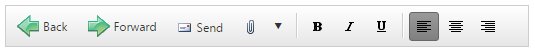
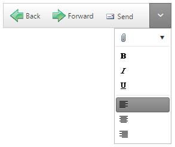

# Responsive Design


Since **Q1 2016** the **RadToolBar** control is fully responsive. It adapts to screen resizing by collapsing its elements under a dropdown button, if there is not enough space to display them all. When the button is clicked a dropdown containing the collapsed items is displayed.  

>note The **RadToolBar**'s responsive design is available only in Lightweight **RenderMode**.

The following example demonstrates the **RadToolBar**'s responsive design capabilities.

Full-size **RadToolBar**:



**RadToolBar** with some of its elements collapsed:



````ASPNET
<telerik:RadToolBar RenderMode="Lightweight" ID="RadToolBar1" runat="server">
    <Items>
        <telerik:RadToolBarButton ImageUrl="~/Images/back.png"
            Text="Back" ToolTip="Back">
        </telerik:RadToolBarButton>
        <telerik:RadToolBarButton ImageUrl="~/Images/forward.png"
            Text="Forward" ToolTip="Forward">
        </telerik:RadToolBarButton>
        <telerik:RadToolBarButton ImageUrl="Images/send.gif"
            Text="Send" ToolTip="Send">
        </telerik:RadToolBarButton>
        <telerik:RadToolBarSplitButton ImageUrl="Images/attach.gif"
            EnableDefaultButton="false">
            <Buttons>
                <telerik:RadToolBarButton ImageUrl="Images/attach.gif"
                    Text="File" ToolTip="Attach File">
                </telerik:RadToolBarButton>
                <telerik:RadToolBarButton Text="Item" ToolTip="Attach Item">
                </telerik:RadToolBarButton>
            </Buttons>
        </telerik:RadToolBarSplitButton>
        <telerik:RadToolBarButton IsSeparator="true">
        </telerik:RadToolBarButton>
        <telerik:RadToolBarButton ImageUrl="Images/bold.gif"
            CheckOnClick="true" Group="Bold" AllowSelfUnCheck="true" ToolTip="Bold">
        </telerik:RadToolBarButton>
        <telerik:RadToolBarButton ImageUrl="Images/italic.gif"
            CheckOnClick="true" Group="Italic" AllowSelfUnCheck="true" ToolTip="Italic">
        </telerik:RadToolBarButton>
        <telerik:RadToolBarButton ImageUrl="Images/underline.gif"
            CheckOnClick="true" Group="Underline" AllowSelfUnCheck="true" ToolTip="Underline">
        </telerik:RadToolBarButton>
        <telerik:RadToolBarButton IsSeparator="true">
        </telerik:RadToolBarButton>
        <telerik:RadToolBarButton ImageUrl="Images/left.gif"
            ToolTip="Align Left" CheckOnClick="true" Group="Align" Checked="true">
        </telerik:RadToolBarButton>
        <telerik:RadToolBarButton ImageUrl="Images/center.gif"
            ToolTip="Align Center" CheckOnClick="true" Group="Align">
        </telerik:RadToolBarButton>
        <telerik:RadToolBarButton ImageUrl="Images/right.gif"
            ToolTip="Align Right" CheckOnClick="true" Group="Align">
        </telerik:RadToolBarButton>
    </Items>
</telerik:RadToolBar>
````

>note If you call the `.hide()` or `.show()` methods of individual items, make sure to call the `.repaint()` method of the toolbar afterwards so that the toolbar can re-calculate which buttons are to be collapsed.

>note All items with the same value for the `Group` property collapse or expand together.

If you have responsiveness issues running your app on iOS or `iframe` container, you can try setting CSS rules to remedy this. Here is a sample:

````CSS
<style>
    [id*='iframe-'] {
        position: relative;
        height: 0;
        max-height: 100%;
        max-width: 100%;
        min-height: 100%;
        min-width: 100%;
        width: 0;
    }
</style>
````


## Preventing items from being collapsed

You can prevent **items** from being collapsed and moved to the dropdown on screen resize, by setting their **OverFlow** property to **Never**:

````ASPNET
...
<telerik:RadToolBarButton ImageUrl="Images/bold.gif"
    CheckOnClick="true" Group="Bold" AllowSelfUnCheck="true" ToolTip="Bold" OverFlow="Never">
</telerik:RadToolBarButton>
...
````
