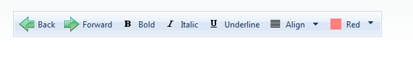

# ToolBar Overview

## 

**Telerik RadToolBar for ASP.NET AJAX** lets you build tool bars used in ASP.NET applications.Using **RadToolBar**, you get

* A [client-side API]() that includes the ability to respond when the user clicks a button without unnecessary postbacks.

* Numerous options in how to populate the toolbar, including

* [Defining items statically at design time]().

* [Creating items dynamically in server-side code]().

* [Creating items dynamically in client-side code]().

* [Loading Items from an XML file or string]().

* [Binding to a data source]().

* [Keyboard support](), covering both web (access keys and tab) and windows (arrows).

* Three different [tool button types](), plus [template support]() that lets you add any type of control to your toolbar.

* Many options for [controlling appearance](), including

* The ability to [add images to items]()

* [Animations]() to customize the way drop-down lists appear and disappear.

* Built-in [skins]() to quickly change the look and feel.

* [Style sheet support for individual items]().

* The ability to create your own [custom skins]().

* Support for [right-to-left locales]().

* [Custom attributes]() to extend the capabilities of the toolbar buttons.

* Lightweight markup (no tables).

* [Cross-page postbacks](), which let you direct postbacks from the toolbar buttons to a different Web page.

* Support for [ASP.NET validation]().

* Support for all major browsers, including Internet Explorer 5.5 and above, Netscape 7.1 and above, Mozilla 1.3 and above,Firefox 1.0 and above, Opera 7.5 and above, and Safari 2.0.4 and above.

