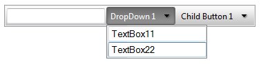

# Custom Attributes


__RadToolBar__ items provide a special collection called __Attributes__. You can use this collection to expand the information stored with the items. The __Attributes__ collection lets you store any number of attributes as name/value pairs.You can specify custom attributes declaratively in the too bar item tag or programmatically using the __Attributes__ collection of the items. You can also access custom attributes client-side, using the __get_attributes__ collection of the toolbar item client-side object.

## Using Attributes declaratively

This example shows how to use custom attributes declaratively to display extra information in toolbar items:

To customize the toolbar items, this example uses an __ItemTemplate__for the items in the toolbar. The custom attributes of the item are used to bind the controls in the template. The template controls are bound using data-binding expressions with typical ASP.NET format and syntax, e.g. "__<%# DataBinder.Eval(Container, "Attributes['DisaplayName']") %>".__ The __DisplayName__ is a custom attribute.



````ASPNET
	    <telerik:RadToolBar ID="RadToolBar1" runat="server">
	        <Items>
	            <telerik:RadToolBarButton runat="server" Text="Button 1" DisplayName="TextBox1">
	                <ItemTemplate>
	                    <input type="text" value='<%# DataBinder.Eval(Container, "Attributes['DisplayName']") %>' />
	                </ItemTemplate>
	            </telerik:RadToolBarButton>
	            <telerik:RadToolBarDropDown runat="server" Text="DropDown 1" DisplayName="DropDown">
	                <Buttons>
	                    <telerik:RadToolBarButton runat="server" Text="Child Button 1" DisplayName="TextBox11">
	                        <ItemTemplate>
	                            <input type="text" value='<%# DataBinder.Eval(Container, "Attributes['DisplayName']") %>' />
	                        </ItemTemplate>
	                    </telerik:RadToolBarButton>
	                    <telerik:RadToolBarButton runat="server" Text="Child Button 2" DisplayName="TextBox21">
	                        <ItemTemplate>
	                            <input type="text" value='<%# DataBinder.Eval(Container, "Attributes['DisplayName']") %>' />
	                        </ItemTemplate>
	                    </telerik:RadToolBarButton>
	                </Buttons>
	            </telerik:RadToolBarDropDown>
	            <telerik:RadToolBarSplitButton runat="server" Text="SplitButton 1" DisplayName="SplitButton">
	                <Buttons>
	                    <telerik:RadToolBarButton runat="server" Text="Child Button 1">
	                    </telerik:RadToolBarButton>
	                    <telerik:RadToolBarButton runat="server" Text="Child Button 2">
	                    </telerik:RadToolBarButton>
	                </Buttons>
	            </telerik:RadToolBarSplitButton>
	        </Items>
	    </telerik:RadToolBar>
````


Before the template can use the custom attributes in its data-binding expressions, the application needs to explicitly bind the items by calling the __DataBind__ method of the __RadToolBarItems__ objects:


````C#
	     
	    protected void Page_Load(object sender, EventArgs e)
	    {   
	        if (!Page.IsPostBack)  
	        {       
	            for (int i = 0; i < RadToolBar1.Items.Count; i++)       
	            {           
	                RadToolBar1.Items[i].DataBind();       
	            }   
	        }
	    }    
				
````
````VB.NET
	
	    Protected Sub Page_Load(ByVal sender As Object, ByVal e As EventArgs) Handles Me.Load
	
	        If Not Page.IsPostBack Then
	            Dim i As Integer = 0
	            While i < RadToolBar1.Items.Count
	                RadToolBar1.Items(i).DataBind()
	                i = i + 1
	            End While
	        End If
	    End Sub
	
````


## Using custom attributes in server-side code

You can add any name/value pair (value must be string) in the __Attributes__ collection of each __RadToolBarItem__ and retrieve it later.


````C#
	     
	
	    RadToolBarButton button = new RadToolBarButton();
	    button.Attributes["DisplayName"] = "CustomText";
	    RadToolBarDropDown dropDown = new RadToolBarDropDown();
	    dropDown.Attributes["DisplayName"] = "CustomText";
	    RadToolBarSplitButton splitButton = new RadToolBarSplitButton();
	    splitButton.Attributes["Displayname"] = "CustomText";
				
````
````VB.NET
	
	    Dim button As New RadToolBarButton()
	    button.Attributes("DisplayName") = "CustomText"
	    Dim dropDown As New RadToolBarDropDown()
	    dropDown.Attributes("DisplayName") = "CustomText"
	    Dim splitButton As New RadToolBarSplitButton()
	    splitButton.Attributes("Displayname") = "CustomText"
	
````


## Using custom attributes client-side

Custom attributes are exposed in the client-side API as well. Each client-side instance of __RadToolBarItems__ has a collection named __attributes__that contains all custom attributes for the respective item. This example demonstrates how to show some custom attributes for the toolbar items. The last two lines of code show how to set a custom attribute to the split button using a pure client-side code.

````JavaScript
	
	        var toolBar = $find("<%=RadToolBar1.ClientID %>");
	        var button = toolBar.findItemByText("Button 1");
	        alert(button.get_attributes().getAttribute("DisplayName"));
	        var dropDown = toolBar.findItemByText("DropDown 1");    
	        alert(dropDown.get_attributes().getAttribute("DisplayName"));
	        var splitButton = toolBar.findItemByText("SplitButton 1");
	        alert(splitButton.get_attributes().getAttribute("DisplayName"));
	        splitButton.get_attributes().setAttribute("NewAttributename", "NewAttributeValue");
	        alert(splitButton.get_attributes().getAttribute("NewAttributename"));
				
````


# See Also

 * [Declaring Items Statically at Design Time]()

 * [Overview]()
